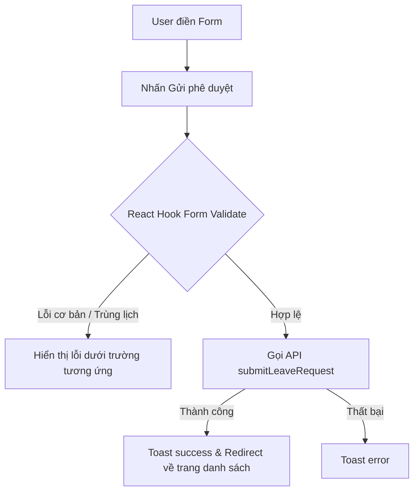

# Báo cáo Thiết kế: Nâng cấp Form Validation cho LeaveNewPage bằng React Hook Form + Zod

Báo cáo này tài liệu hóa thiết kế nâng cấp cơ chế kiểm định dữ liệu (validation) cho trang tạo đơn xin nghỉ phép (`LeaveNewPage`) từ kiểm tra thủ công bằng `useState` sang sử dụng thư viện **React Hook Form** kết hợp **Zod** (`zodResolver`).

---

## 1. Yêu cầu & Tiêu chí Nghiệm thu (Requirements & Acceptance Criteria)
* **Expected Output:** Refactor file `LeaveNewPage` (`packages/web/src/features/leave-requests/components/leave-new-page.tsx`) sử dụng `react-hook-form` + `zod` (`zodResolver`).
* **Validation Rules:**
  * **Loại đơn nghỉ (`leaveTypeId`):** Bắt buộc phải chọn (phải là số hợp lệ sau khi convert).
  * **Ngày bắt đầu (`startDate`):** Phải lớn hơn hoặc bằng ngày hôm nay (không được chọn ngày trong quá khứ).
  * **Ngày kết thúc (`endDate`):** Phải lớn hơn hoặc bằng ngày bắt đầu.
  * **Lý do nghỉ (`reason`):** Bắt buộc nhập, không được chỉ chứa khoảng trắng.
  * **Trùng lịch nghỉ (Overlap Check):** Toàn bộ khoảng ngày nghỉ xin phép (`startDate` đến `endDate`) không được trùng với bất kỳ ngày nào trong danh sách các ngày nghỉ đã được phê duyệt (`approvedDates`). Lỗi này sẽ được ánh xạ trực tiếp vào trường `startDate` hoặc `endDate`.
* **UI/UX:** Hiển thị thông báo lỗi màu đỏ ngay dưới từng trường dữ liệu bị lỗi thay vì hiển thị thông báo `toast.error` chung chung cho toàn bộ form.
* **Scope Boundary:** Chỉ sửa đổi file `LeaveNewPage`. Không thay đổi logic API hoặc các trang khác.

---

## 2. Các phương án thiết kế (Design Approaches)

### Phương án 1: Tạo Schema động với `superRefine` (Được chọn)
Schema được định nghĩa động thông qua hàm khởi tạo nhận danh sách ngày nghỉ đã phê duyệt (`approvedDates`) và ngày hôm nay (`today`).
* **Chi tiết kỹ thuật:**
  * Định nghĩa `createLeaveRequestSchema(approvedDates: Set<string>, today: string)`.
  * Sử dụng `.superRefine` để so sánh chéo `startDate` và `endDate` (đảm bảo `startDate <= endDate`).
  * Thực hiện kiểm tra trùng lặp bằng cách duyệt qua các ngày từ `startDate` đến `endDate` và so sánh với `approvedDates` trong `.superRefine`. Nếu trùng, báo lỗi tại `startDate` hoặc `endDate`.
* **Đánh giá:**
  * *Ưu điểm:* Toàn bộ logic validation tập trung tại một nơi (Zod Schema), lỗi trùng ngày hiển thị trực quan dưới input.
  * *Nhược điểm:* Schema cần được định nghĩa lại khi `approvedDates` thay đổi (có thể memoize bằng `useMemo`).

### Phương án 2: Schema tĩnh + Validate thủ công trùng lịch
Sử dụng Zod Schema tĩnh cho các lỗi định dạng và kiểu dữ liệu (tên, ngày, lý do) và giữ nguyên logic overlap check trong hàm submit.
* **Đánh giá:**
  * *Ưu điểm:* Schema đơn giản, tĩnh.
  * *Nhược điểm:* UX không đồng nhất, lỗi trùng lịch vẫn dùng `toast.error` thay vì báo lỗi dưới input.

---

## 3. Kiến trúc Đề xuất (Proposed Architecture)

### Sơ đồ luồng xử lý (Data Flow)


### Chi tiết thiết kế Schema
```typescript
import { z } from "zod";
import { differenceInBusinessDays, parseISO, eachDayOfInterval, format } from "date-fns";

export const createLeaveRequestSchema = (approvedDates: Set<string>, today: string) => {
  return z.object({
    leaveTypeId: z.string().min(1, "Vui lòng chọn loại phép"),
    startDate: z.string().min(1, "Vui lòng chọn ngày bắt đầu"),
    endDate: z.string().min(1, "Vui lòng chọn ngày kết thúc"),
    reason: z.string()
      .min(1, "Vui lòng nhập lý do")
      .refine(val => val.trim().length > 0, "Lý do nghỉ không được chỉ chứa khoảng trắng"),
  }).superRefine((data, ctx) => {
    if (!data.startDate || !data.endDate) return;

    // 1. So sánh ngày bắt đầu và kết thúc
    if (data.startDate > data.endDate) {
      ctx.addIssue({
        code: z.ZodIssueCode.custom,
        message: "Ngày bắt đầu phải trước hoặc trùng ngày kết thúc",
        path: ["endDate"],
      });
      return;
    }

    // 2. Kiểm tra ngày trong quá khứ
    if (data.startDate < today) {
      ctx.addIssue({
        code: z.ZodIssueCode.custom,
        message: "Không được chọn ngày trong quá khứ",
        path: ["startDate"],
      });
      return;
    }

    // 3. Kiểm tra trùng lịch nghỉ (Overlap)
    try {
      const interval = { start: parseISO(data.startDate), end: parseISO(data.endDate) };
      const hasOverlap = eachDayOfInterval(interval).some(
        (d) => approvedDates.has(format(d, "yyyy-MM-dd"))
      );
      if (hasOverlap) {
        ctx.addIssue({
          code: z.ZodIssueCode.custom,
          message: "Khoảng ngày nghỉ trùng với đơn đã được duyệt",
          path: ["startDate"],
        });
      }
    } catch {
      // Bỏ qua lỗi parse ngày không hợp lệ
    }
  });
};
```

---

## 4. Kế hoạch và các bước tiếp theo (Next Steps)
1. **Thiết lập Schema:** Tích hợp `createLeaveRequestSchema` và `useForm` với `zodResolver` vào component `LeaveNewPage`.
2. **Refactor UI:** Thay thế các input hiện tại bằng cách liên kết chúng với các props nhận từ `register` của RHF. Đảm bảo component UI `<Select>` từ shadcn được bọc hoặc xử lý đúng cách bằng cách cập nhật giá trị thông qua `setValue` hoặc sử dụng `<Controller>`.
3. **Hiển thị lỗi:** Hiển thị thẻ `<span className="text-red-500 text-xs">` dưới mỗi input nếu có lỗi trong `errors`.
4. **Kiểm thử thủ công:** Đảm bảo tất cả luật kiểm định hoạt động bình thường, đặc biệt là kiểm tra trùng ngày nghỉ.
