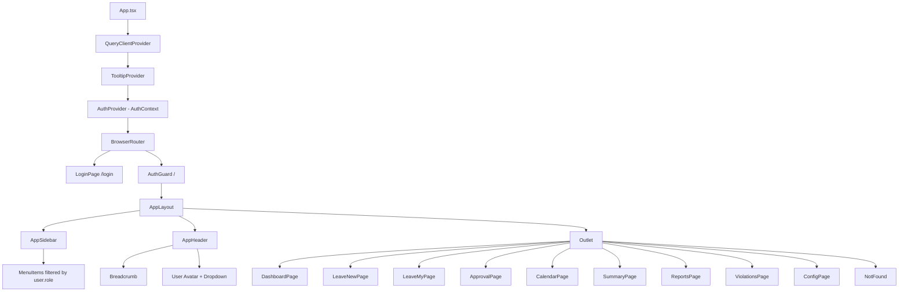
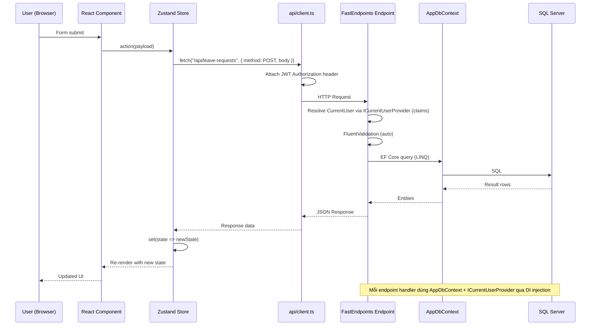
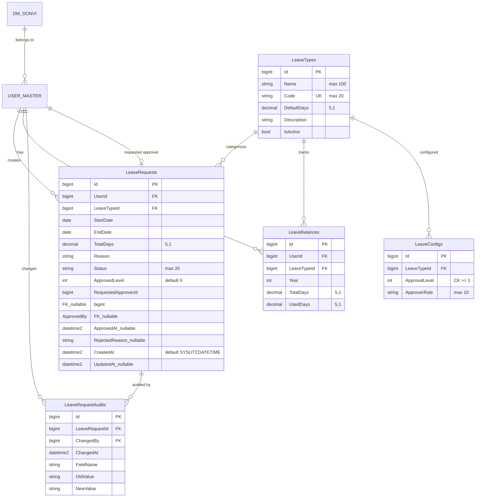
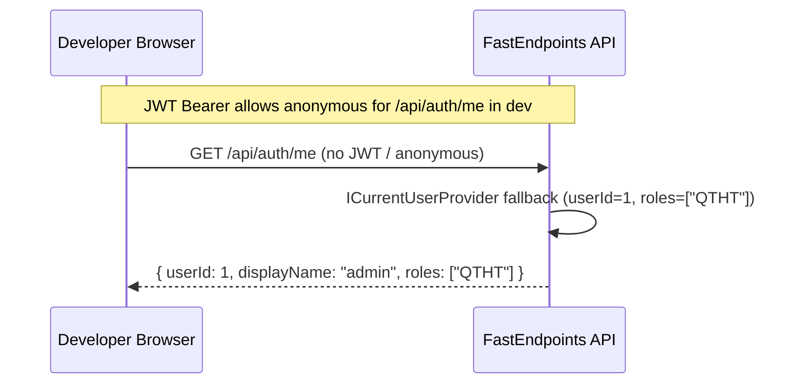
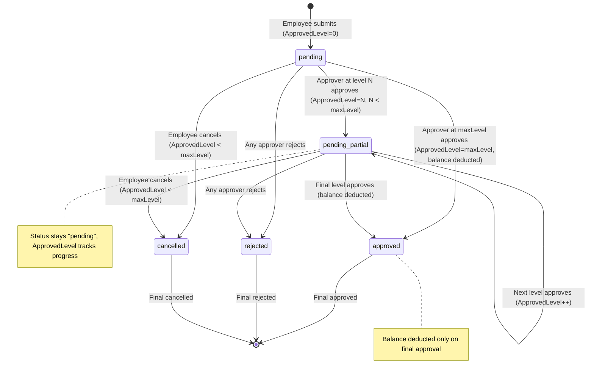
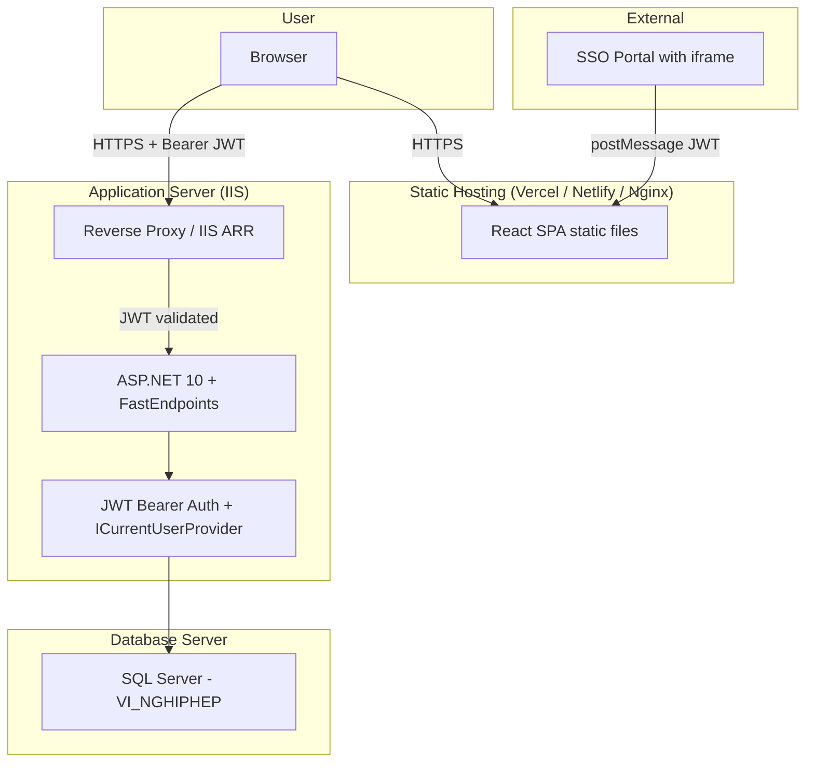

# System Architecture - QLNP-TTCDS

## ~~Supabase Prototype~~ (DEPRECATED — removed in Phase 1)

Supabase architecture replaced by .NET API + SQL Server. All Supabase code, deps, and migrations removed.

## Current Architecture (Phase 1): .NET 10 + EF Core + JWT Bearer Auth

### High-Level

```
Host Website (SSO Portal)
  └─ iframe ─ React SPA (Vite)
       ├─ AuthContext (JWT from postMessage or localStorage)
       ├─ Zustand Store (data only, no auth)
       └─ api/client.ts (fetch + Bearer JWT)
            │
            ▼ GET/POST/PUT/DELETE /api/*
ASP.NET 10 FastEndpoints API
  ├─ JWT Bearer Authentication (Issuer, Audience, SigningKey from appsettings.json)
  ├─ ICurrentUserProvider (reads ClaimsPrincipal from JWT, returns CurrentUser record)
  ├─ Features/                     ← Vertical Slices
  │   ├─ Auth/Me/                  MeEndpoint (implemented)
  │   ├─ Config/Get, Update/       config endpoints implemented
  │   ├─ Departments/List, Get/    department reference endpoints
  │   ├─ LeaveBalances/List, My, Seed/  lazy/startup balance seeding
  │   ├─ LeaveRequests/List, Create, Update, Approve, Reject, Cancel/  ← config-driven N-level approval
  │   │   ├─ ApprovalHelper.cs (shared logic: GetApprovalFlow, CanApproveAtLevel, GetMaxLevel, GetNextLevelRoles)
	  │   │   ├─ LeaveRequestMapping.cs (shared DRY DTO mapping, includes ApprovedLevel)
  │   │   └─ BusinessDayCalculator.cs (T2-T6 inclusive)
  │   ├─ Reports/Export/           ClosedXML .xlsx export
  │   └─ LeaveTypes/List, Create, Update, Delete/  ← Roles("QTHT")
  ├─ Data/AppDbContext              (EF Core 9 + SQL Server)
  │   ├─ System tables: USER_MASTER, DM_DONVI (ExcludeFromMigrations)
	  │   └─ App tables: LeaveTypes, LeaveBalances, LeaveRequests (incl. ApprovedLevel), LeaveConfigs, LeaveRequestAudits
  └─ SQL Server (existing `VI_NGHIPHEP` database)
```

### Vertical Slice Architecture Pattern

```
┌─────────────────────────────────────────────────────────┐
│  Traditional Layered (N-tier)    │  Vertical Slice      │
│                                  │                      │
│  Controllers/                    │  Features/           │
│    AuthController.cs             │    Auth/             │
│    EmployeeController.cs         │      Login/          │
│    LeaveController.cs            │        LoginEndpoint │
│  Services/                       │        LoginRequest  │
│    AuthService.cs                │        LoginResponse │
│    EmployeeService.cs            │        LoginValidator│
│    LeaveService.cs               │      Exchange/       │
│  Repositories/                   │        ...           │
│    AuthRepo.cs                   │      Me/             │
│    EmployeeRepo.cs               │        ...           │
│    LeaveRepo.cs                  │    Employees/        │
│                                  │      List/           │
│  Cross-cutting changes touch     │        ...           │
│  all layers → high coupling      │      Create/         │
│                                  │        ...           │
│                                  │                      │
│                                  │  Each slice is self- │
│                                  │  contained → low     │
│                                  │  coupling, easy to   │
│                                  │  change independently│
└─────────────────────────────────────────────────────────┘
```

**Nguyên tắc chính**:
- Mỗi feature là một vertical slice khép kín: Endpoint + Request DTO + Response DTO + Validator + Handler logic
- Data access qua EF Core DbContext (DI inject), không có repository layer riêng
- Cross-cutting concerns (current user resolution, DB connection, logging) nằm trong middleware hoặc shared utilities
- Thêm feature mới = thêm 1 folder trong Features/, không đụng đến code hiện có

## Component Tree



## Data Flow



## Database ERD

### System Tables (scaffolded, read-only, ExcludeFromMigrations)

**DM_DONVI** (22 properties): DonViId (PK), MaDonVi, TenDonVi, TenVietTat, DonViCapChaId, Cap, CapDonViId, LoaiDonViId, SoNha, DuongId, TinhThanhId, QuanHuyenId, PhuongXaId, DiaChiDayDu, DienThoai, Fax, Email, Website, MoTa, Used, Latitude, Longitude

**USER_MASTER** (9 properties + DonVi nav prop): UserMasterId (PK), UserName, HoTen, PhongBanId, DonViId, UserPortalId, CanBoId, LaDonViChinh, Used. Navigation: DonVi -> DM_DONVI

### QLNP Tables (Code First, managed by EF Core migrations)



### Seed Data
- LeaveTypes: NPN (12 days), NO (30 days), NVR (3 days), NKL (0 days), NTS (180 days) -- seeded via `HasData` in `AppDbContext.OnModelCreating`
- LeaveConfigs: 9 rows seeded via `HasData` establishing the initial approval-level baseline per LeaveType. This baseline is required so `MigrateLegacyStatusesAsync` can correctly calculate max approval levels per LeaveType at startup. The `Config/Update` endpoint (`ReplaceAllAsync`) can overwrite these rows at runtime.

  | LeaveTypeId (Code) | ApprovalLevel | ApproverRole |
  |---------------------|---------------|--------------|
  | 1 (NPN)             | 1             | LD.PCM       |
  | 1 (NPN)             | 2             | GD.PGD       |
  | 2 (NO)              | 1             | LD.PCM       |
  | 2 (NO)              | 2             | GD.PGD       |
  | 3 (NVR)             | 1             | LD.PCM       |
  | 3 (NVR)             | 2             | GD.PGD       |
  | 4 (NKL)             | 1             | LD.PCM       |
  | 5 (NTS)             | 1             | LD.PCM       |
  | 5 (NTS)             | 2             | GD.PGD       |

- LeaveBalances: seeded on startup for active `USER_MASTER` users and lazily during `/leave-balances` reads
- Roles: resolved from JWT claims; dev-login maps known test users to roles. `UserRoles` table was dropped.

## Authentication Flow

### JWT Bearer Auth via SSO Portal (production)

```mermaid
sequenceDiagram
    participant Host as SSO Portal (host)
    participant R as React SPA (iframe)
    participant API as FastEndpoints API
    participant DB as SQL Server

    Note over Host,DB: User already authenticated on SSO Portal
    Host->>R: postMessage({ type: "auth", token: jwt })
    R->>R: AuthContext stores JWT in localStorage
    R->>API: GET /api/auth/me (Bearer JWT)
    API->>API: JWT validation + ICurrentUserProvider reads claims
    API->>DB: Lookup USER_MASTER; roles come from JWT claims
    API-->>R: { userId, displayName, roles, ... }
    R->>R: AuthState updated, app rendered
```

### Dev Mode (standalone)



**Note**: Login form removed. Authentication delegated to SSO Portal which issues JWT. The API validates JWT via symmetric key (Jwt:SigningKey in appsettings.json). ICurrentUserProvider reads ClaimsPrincipal, no longer uses gateway headers or CurrentUserMiddleware.

## Approval Workflow (Config-Driven N-Level)



**Design decisions:**
- `ApprovedLevel = 0` = no approvals (pending)
- `ApprovedLevel = maxLevel` = fully approved (status = approved)
- Status values: `pending | approved | rejected | cancelled` (no more approved_leader/approved_director)
- OR logic per level: any configured approver role can advance the request
- Scope: LD.PCM can only approve requests from same department (not own); GD.PGD has no scope restriction
- Balance deduction only on final approval (ApprovedLevel == maxLevel)
- `ApprovalHelper.cs` provides shared logic: GetApprovalFlow, CanApproveAtLevel, GetMaxLevel, GetNextLevelRoles

## Deployment Architecture



## Key Architectural Decisions

| Decision | Rationale |
|----------|-----------|
| **FastEndpoints** thay vì Minimal API | Mỗi endpoint là 1 class riêng (REPR pattern) → dễ test, dễ maintain, pipeline behaviors rõ ràng (Validator → PreProcessor → Handler → PostProcessor) |
| **EF Core** thay vì Dapper | Type-safe LINQ queries, migrations built-in, change tracking. Phù hợp khi làm việc với DB có sẵn (scaffold system tables + Code First app tables) |
| **JWT Bearer Auth** thay vì gateway headers | SSO Portal issues JWT, app nhận qua postMessage (iframe) hoặc Authorization header. API validates JWT via symmetric key. ICurrentUserProvider reads claims → CurrentUser record. Đã bỏ CurrentUserMiddleware và gateway headers |
| **ExcludeFromMigrations** cho system tables | USER_MASTER, DM_DONVI là các bảng có sẵn của hệ thống khác. Không được phép thay đổi schema. EF Core chỉ đọc dữ liệu |
| **Vertical Slice Architecture** thay vì N-tier | Code tổ chức theo feature, không theo layer kỹ thuật. Thêm/sửa feature = làm việc trong 1 folder, không lan sang các layer khác → giảm coupling, tăng cohesion |
| Single Zustand store | Data-only state management. Auth state moved to React Context. Limited state surface area for intranet app |
| Role-based sidebar (not route guards) | SPA UX: all routes mounted, navigation elements hidden by role. Simple and effective for intranet |
| Business days calculation (date-fns) | Standard for government/education leave tracking |
| shadcn/ui (Radix primitives) | Production-ready accessible components, customizable via CSS variables |
| No SSR | Intranet app behind auth, no SEO needed. SPA is simpler to deploy and maintain |
| pnpm monorepo | `packages/api` (.NET 10) + `packages/web` (React SPA). Shared tooling, single repo |
