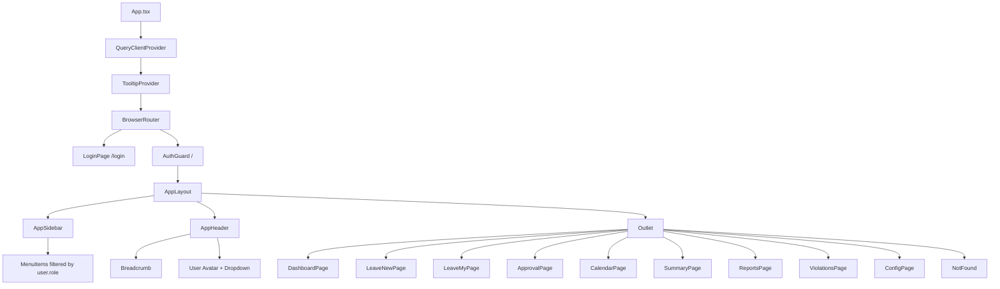
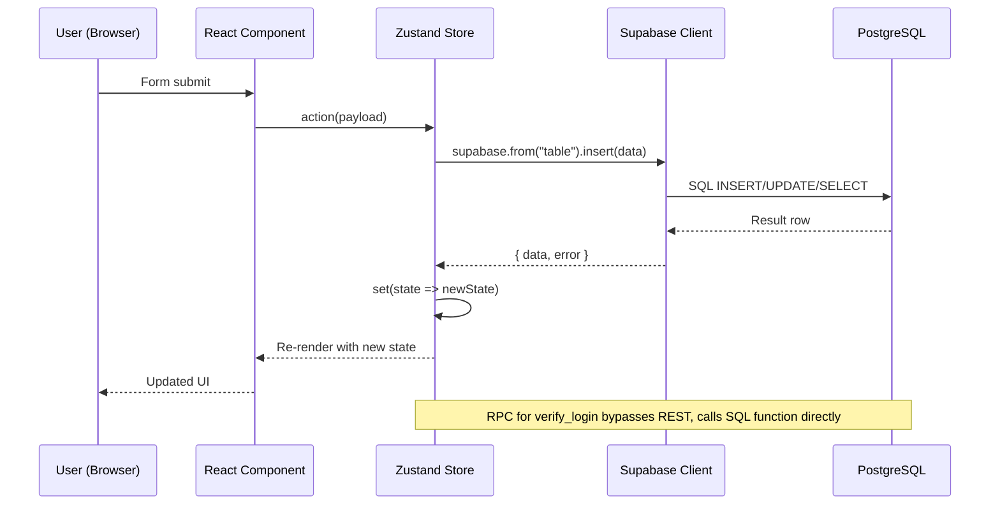
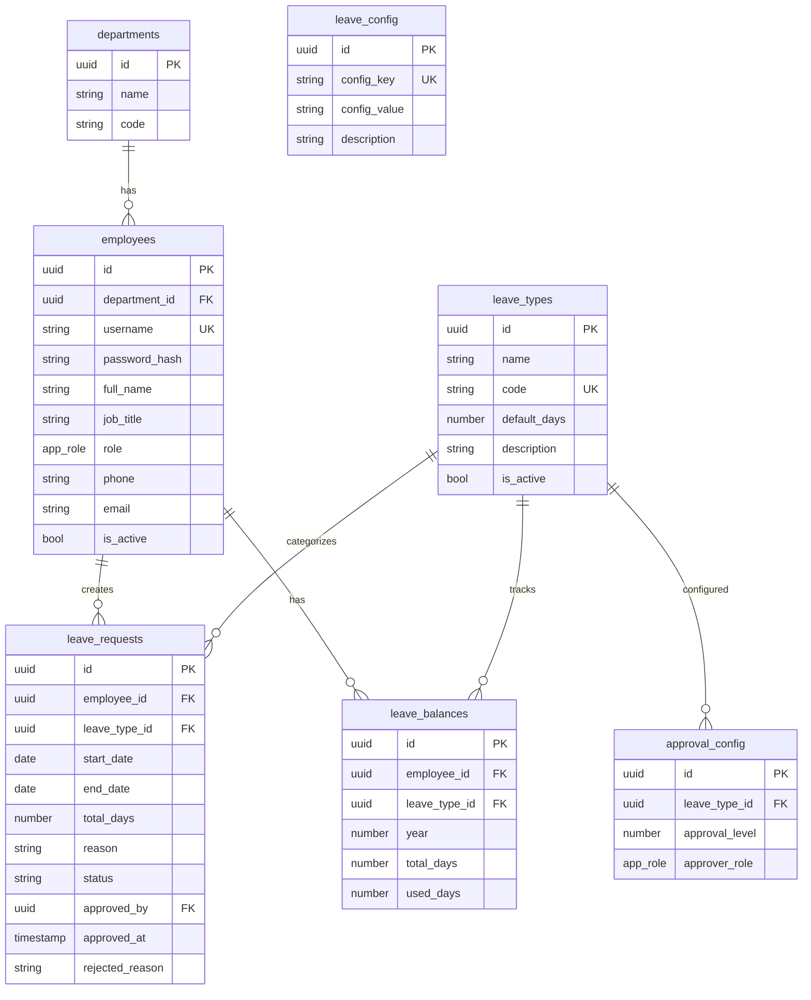
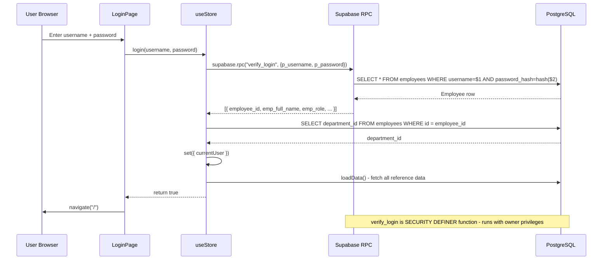
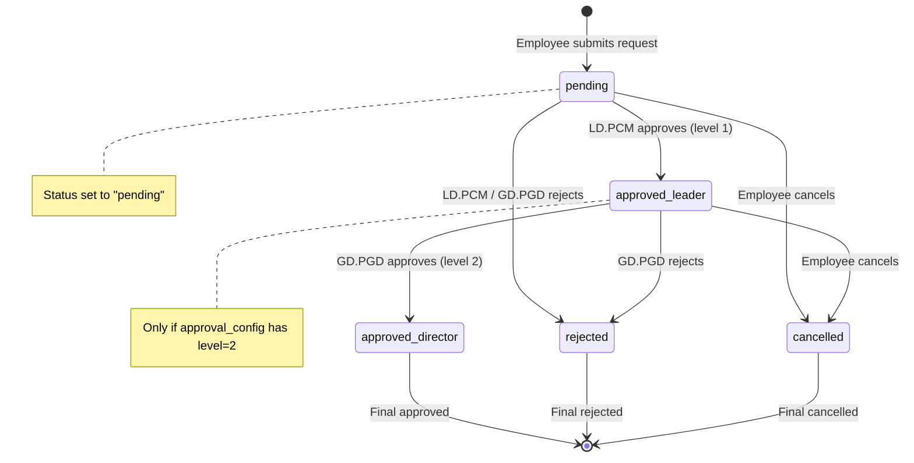
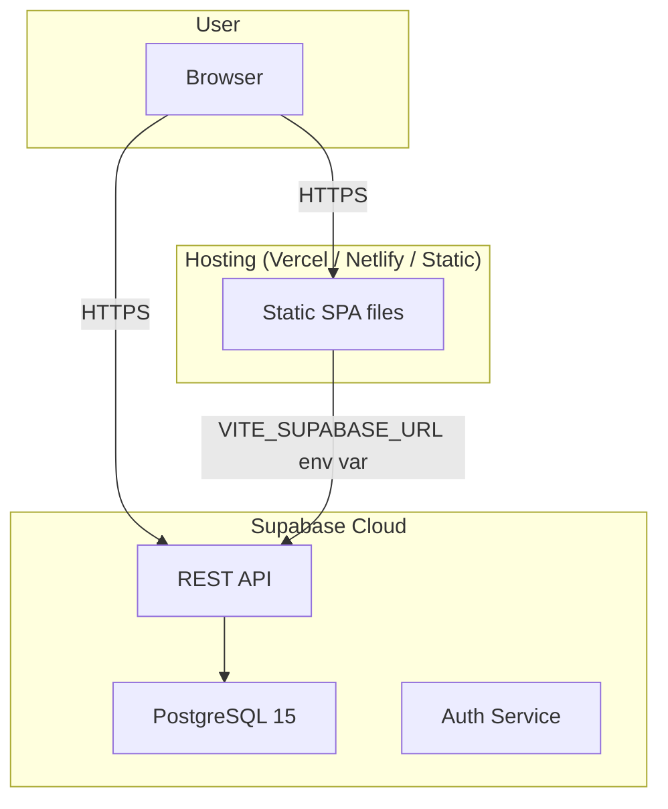

# System Architecture - QLNP-TTCDS

## High-Level Architecture

```
Browser (React SPA)
    |
    | HTTPS (REST + RPC)
    v
Supabase (Backend-as-a-Service)
    |--- PostgreSQL Database
    |--- Row Level Security (RLS)
    |--- SECURITY DEFINER RPC Functions
```

## Component Tree



## Data Flow



## Database ERD



## Authentication Flow



## Approval Workflow



## Deployment Architecture



## Key Architectural Decisions

| Decision | Rationale |
|----------|-----------|
| Single Zustand store | Simple app, limited state surface area. Avoids prop drilling and context explosion |
| Supabase as sole backend | No dedicated API server needed. PostgreSQL + RLS + RPC handles all business logic |
| Role-based sidebar (not route guards) | SPA UX: all routes mounted, navigation elements hidden by role. Simple and effective for intranet |
| Business days calculation (date-fns) | Standard for government/education leave tracking. differenceInBusinessDays handles Vietnamese weekends automatically if locale configured |
| shadcn/ui (Radix primitives) | Production-ready accessible components, customizable via CSS variables |
| No SSR | Intranet app behind auth, no SEO needed. SPA is simpler to deploy and maintain |
| Password stored as hash in employees table | Custom auth via SECURITY DEFINER RPC. Not using Supabase Auth for simplicity in internal context |
