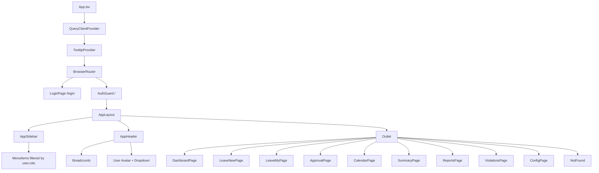
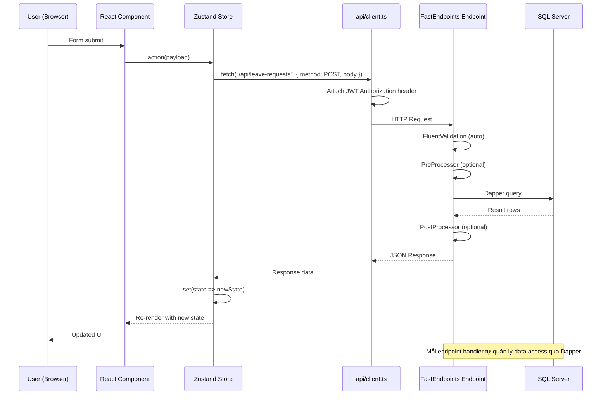
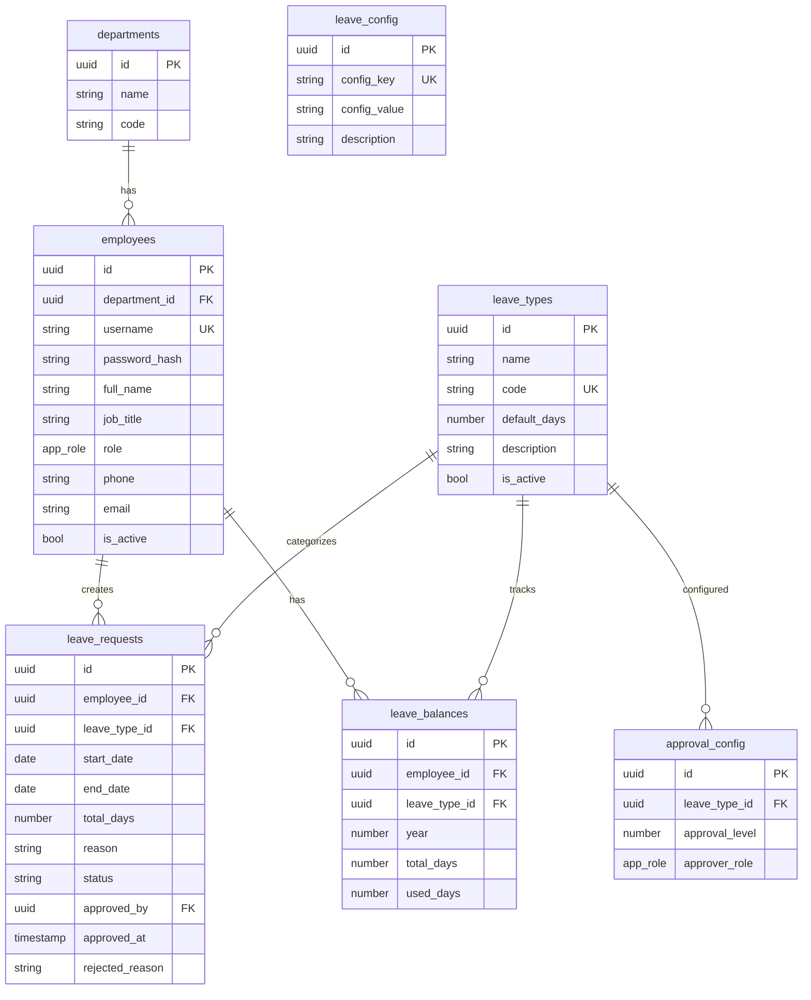
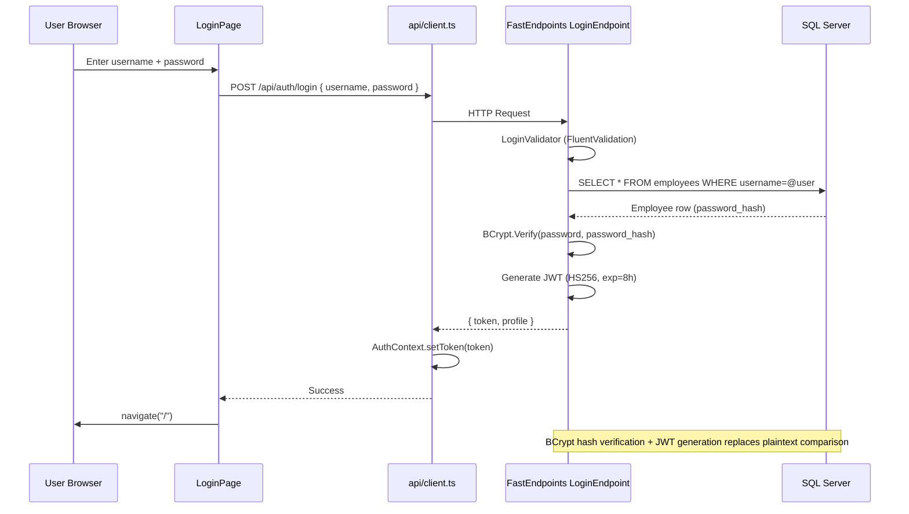
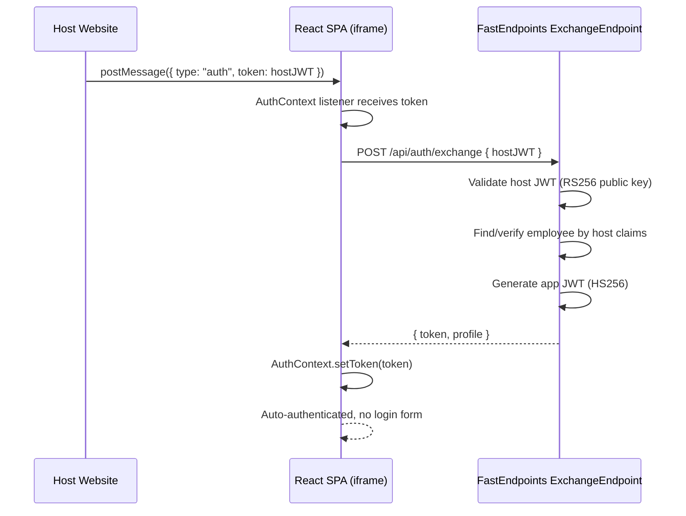
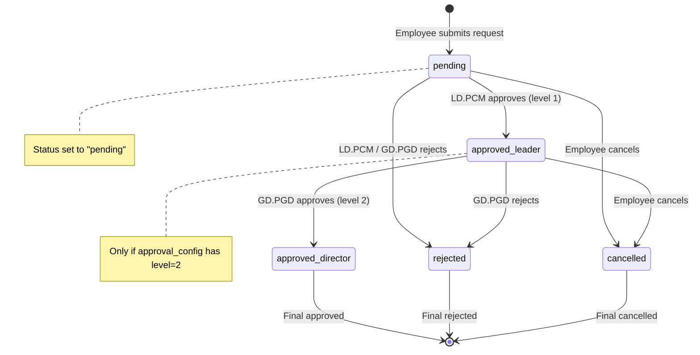
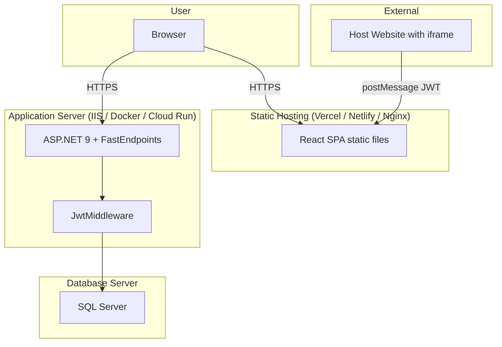

# System Architecture - QLNP-TTCDS

## Current Architecture (AS-IS)

```
Browser (React SPA)
    |
    | HTTPS (REST + RPC)
    v
Supabase (Backend-as-a-Service)
    |--- PostgreSQL Database
    |--- Row Level Security (RLS)
    |--- SECURITY DEFINER RPC Functions
```

## Target Architecture (TO-BE): FastEndpoints + Vertical Slice Architecture

### High-Level

```
Host Website (optional)
  └─ iframe ─ React SPA (Vite)
       ├─ AuthContext (JWT: own + host)
       ├─ Zustand Store
       └─ api/client.ts (fetch + JWT intercept)
            │
            ▼ POST/GET /api/*
ASP.NET 9 FastEndpoints API
  ├─ JwtMiddleware (own issuer HS256 + host issuer RS256)
  ├─ Features/                 ← Vertical Slices
  │   ├─ Auth/Login/           LoginEndpoint + Request + Response + Validator
  │   ├─ Auth/Exchange/        ExchangeEndpoint
  │   ├─ Auth/Me/              MeEndpoint
  │   ├─ Employees/            List/Create/Update/Delete
  │   ├─ Departments/          List/Create/Update/Delete
  │   ├─ LeaveRequests/        List/Create/Update/Approve/Reject/Cancel
  │   ├─ LeaveBalances/        List/My
  │   └─ Config/               Get/Update
  ├─ Data/DbConnectionFactory  (SQL Server IDbConnection)
  └─ SQL Server
```

### Vertical Slice Architecture Pattern

```
┌─────────────────────────────────────────────────────────┐
│  Traditional Layered (N-tier)    │  Vertical Slice      │
│                                  │                      │
│  Controllers/                    │  Features/           │
│    AuthController.cs             │    Auth/             │
│    EmployeeController.cs         │      Login/          │
│    LeaveController.cs            │        LoginEndpoint │
│  Services/                       │        LoginRequest  │
│    AuthService.cs                │        LoginResponse │
│    EmployeeService.cs            │        LoginValidator│
│    LeaveService.cs               │      Exchange/       │
│  Repositories/                   │        ...           │
│    AuthRepo.cs                   │      Me/             │
│    EmployeeRepo.cs               │        ...           │
│    LeaveRepo.cs                  │    Employees/        │
│                                  │      List/           │
│  Cross-cutting changes touch     │        ...           │
│  all layers → high coupling      │      Create/         │
│                                  │        ...           │
│                                  │                      │
│                                  │  Each slice is self- │
│                                  │  contained → low     │
│                                  │  coupling, easy to   │
│                                  │  change independently│
└─────────────────────────────────────────────────────────┘
```

**Nguyên tắc chính**:
- Mỗi feature là một vertical slice khép kín: Endpoint + Request DTO + Response DTO + Validator + Handler logic + Data access
- Không có Controllers, Services, Repositories layer dùng chung — mỗi slice tự quản lý data access qua Dapper
- Cross-cutting concerns (JWT validation, DB connection, logging) nằm trong middleware hoặc shared utilities
- Thêm feature mới = thêm 1 folder trong Features/, không đụng đến code hiện có

## Component Tree



## Data Flow (TO-BE)



## Database ERD



## Authentication Flow (TO-BE)



### Embed Auth Flow (TO-BE)



## Approval Workflow



## Deployment Architecture (TO-BE)



## Key Architectural Decisions

| Decision | Rationale |
|----------|-----------|
| **FastEndpoints** thay vì Minimal API | Mỗi endpoint là 1 class riêng (REPR pattern) → dễ test, dễ maintain, pipeline behaviors rõ ràng (Validator → PreProcessor → Handler → PostProcessor) |
| **Vertical Slice Architecture** thay vì N-tier | Code tổ chức theo feature, không theo layer kỹ thuật. Thêm/sửa feature = làm việc trong 1 folder, không lan sang các layer khác → giảm coupling, tăng cohesion |
| Dapper thay vì EF Core | Viết SQL thuần, kiểm soát hiệu năng truy vấn. Phù hợp với team quen SQL |
| Single Zustand store | Simple app, limited state surface area. Avoids prop drilling and context explosion |
| Role-based sidebar (not route guards) | SPA UX: all routes mounted, navigation elements hidden by role. Simple and effective for intranet |
| Business days calculation (date-fns) | Standard for government/education leave tracking |
| shadcn/ui (Radix primitives) | Production-ready accessible components, customizable via CSS variables |
| No SSR | Intranet app behind auth, no SEO needed. SPA is simpler to deploy and maintain |
| BCrypt hash + JWT auth | Replaces plaintext Supabase auth. JWT với 2 issuer (own + host) hỗ trợ cả standalone và embed mode |
