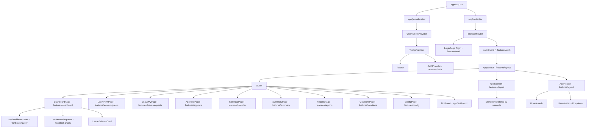
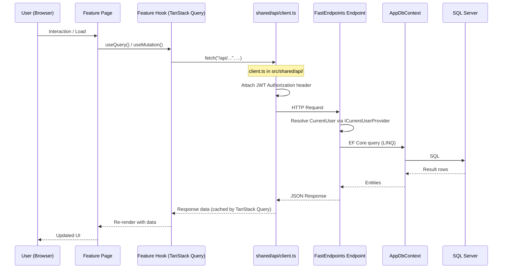
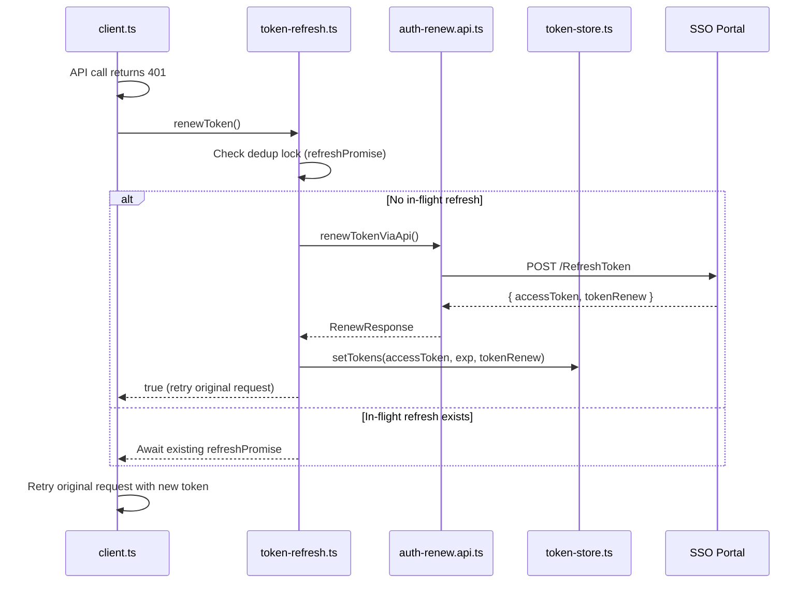
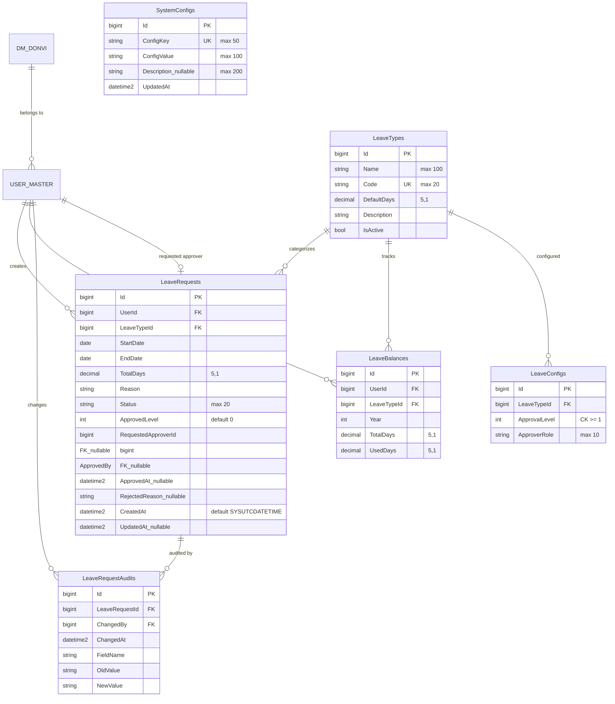
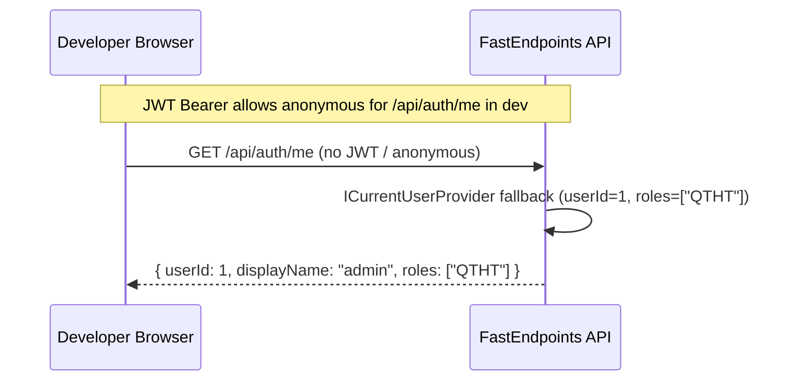
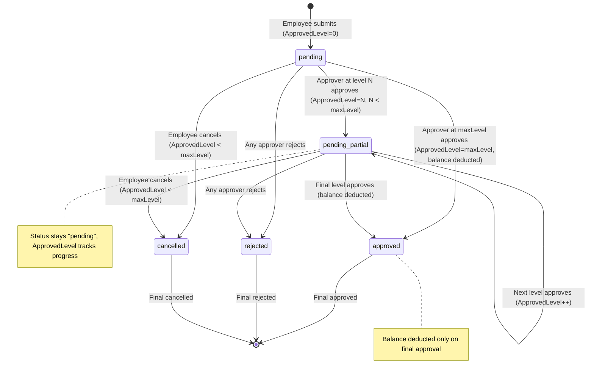
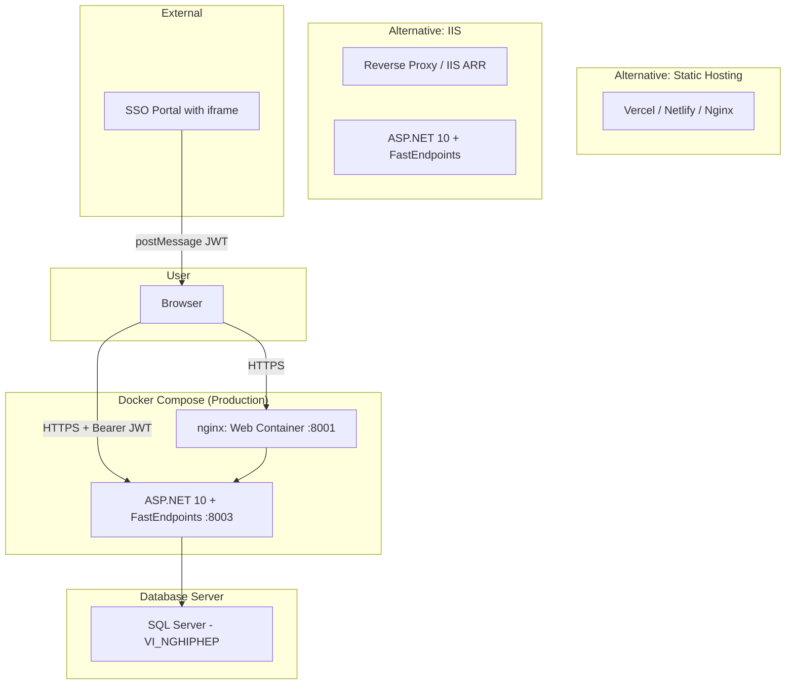

# System Architecture - QLNP-TTCDS

## ~~Supabase Prototype~~ (DEPRECATED -- removed in Phase 1)

Supabase architecture replaced by .NET API + SQL Server. All Supabase code, deps, and migrations removed.

## Current Architecture (Phase 12+): .NET 10 + React VSA

### High-Level Frontend (Vertical Slice Architecture)

```
React SPA (Vite)
  ├─ app/                        ← App shell (App.tsx, providers, router, NotFound)
  ├─ shared/                     ← Generic infrastructure (api client, lib, hooks, ui)
  │   ├─ api/client.ts (fetch + Bearer JWT + 401 auto-retry)
  │   ├─ lib/ (utils, date-utils, auth-renew.api, token-refresh, token-store)
  │   ├─ hooks/ (use-mobile, use-toast)
  │   └─ ui/ (52 shadcn/ui components incl. date-picker, error-boundary, route-error-boundary)
  ├─ features/                   ← Feature modules (VSA)
  │   ├─ auth/                    ← Auth feature (SSO + 401-reactive token renewal)
  │   ├─ layout/                  ← App shell components (Sidebar, Header)
  │   ├─ dashboard/               ← Dashboard + MyStats
  │   ├─ leave-requests/          ← Leave CRUD + balances + date picker
  │   ├─ approval/                ← N-level approval logic
  │   ├─ calendar/                ← Leave calendar view
  │   ├─ summary/                 ← GD.PGD summary view
  │   ├─ reports/                 ← GD.PGD reports + XLSX export
  │   ├─ violations/              ← GD.PGD violation monitoring
  │   ├─ config/                  ← QTHT system configuration (incl. work days)
  │   └─ shared-reference-data/   ← Cross-feature types & constants
  └─ test/                       ← Test utilities & mock factories
```

**VSA Principles Applied:**
- **Feature Colocation**: Components, hooks, API, and types live together in feature folders.
- **Public API**: Each feature exports a clean interface via `index.ts`.
- **Boundary Enforcement**: ESLint rules block deep imports and illegal cross-feature dependencies.
- **Server State**: 100% TanStack Query. No global data store (Zustand fully removed).

### High-Level Backend (Vertical Slice Architecture)
  ├─ JWT Bearer Authentication (Issuer, Audience, SigningKey from appsettings.json)
  ├─ ICurrentUserProvider (reads ClaimsPrincipal from JWT, returns CurrentUser record)
  ├─ Features/                     ← Vertical Slices (VSA {Action}{Role}.cs pattern)
  │   ├─ Auth/Me/, DevLogin/       Auth endpoints
  │   ├─ Departments/List/, Get/   department reference endpoints
  │   ├─ LeaveBalances/List/, My/  balance endpoints + seed helpers
  │   ├─ LeaveRequests/List, Create, Update, Approve, Reject, Cancel, My/  ← config-driven N-level approval
  │   │   ├─ LeaveRequestMapping.cs (shared DRY DTO mapping, includes ApprovedLevel)
  │   │   └─ LeaveRequestDto.cs (shared DTO)
  │   ├─ LeaveTypes/List, Create/, Update/, Delete/  ← Roles(AppRoles.Admin)
  │   ├─ MyStats/MyStatsEndpoint  ← GET /api/my-stats/ (RemainingDays, PendingCount, ApprovedCount, UsedDays)
  │   ├─ SystemConfigs/Get, Update, GetLeaveConfigs, ReplaceLeaveConfigs/  ← system settings + approval config
  │   └─ Reports/Export/           ClosedXML .xlsx export (Director-only)
  ├─ Shared/                        ← Cross-cutting shared code
  │   ├─ Domain/                    ← Entities, domain services, helpers
  │   │   ├─ LeaveRequest.cs, LeaveType.cs, LeaveBalance.cs, ... (all domain entities)
  │   │   ├─ ApprovalHelper.cs, BusinessDayCalculator.cs       (domain logic)
  │   │   │   └─ BusinessDayCalculator.ParseWorkDays(): configurable work days from SystemConfig `work_days`
  │   │   ├─ LeaveBalanceService.cs, ILeaveBalanceService.cs    (domain service)
  │   │   └─ LeaveBalanceSeeding.cs                              (seeding logic)
  │   ├─ Contracts/                 ← Shared response envelopes
  │   │   ├─ Result<T>             (success/error envelope)
  │   │   └─ PagedData<T>          (paginated list envelope)
  │   ├─ Groups/                    ← FastEndpoints route groups
  │   │   └─ AuthGroup, LeaveRequestGroup, LeaveTypeGroup, LeaveBalanceGroup, DepartmentGroup, MyStatsGroup, SystemConfigGroup
  │   └─ Middleware/
  │       └─ CurrentUser.cs         (CurrentUser record)
  ├─ Infrastructure/
  │   └─ Auth/                      ← Auth infrastructure
  │       ├─ ICurrentUserProvider.cs, CurrentUserProvider.cs, Roles.cs (AppRoles constants)
  ├─ Data/AppDbContext              (EF Core 9 + SQL Server)
  │   ├─ System tables: USER_MASTER, DM_DONVI (ExcludeFromMigrations)
  │   └─ App tables: LeaveTypes, LeaveBalances, LeaveRequests (incl. ApprovedLevel), LeaveConfigs, SystemConfigs, LeaveRequestAudits, UserRoles
  └─ SQL Server (existing `VI_NGHIPHEP` database)

### Vertical Slice Architecture Pattern

```
┌─────────────────────────────────────────────────────────┐
│  Traditional Layered (N-tier)    │  Vertical Slice      │
│                                  │                      │
│  Controllers/                    │  Features/           │
│    AuthController.cs             │    Auth/             │
│    EmployeeController.cs         │      Login/          │
│    LeaveController.cs            │        LoginEndpoint │
│  Services/                       │        LoginRequest  │
│    AuthService.cs                │        LoginResponse │
│    EmployeeService.cs            │        LoginValidator│
│    LeaveService.cs               │      Exchange/       │
│  Repositories/                   │        ...           │
│    AuthRepo.cs                   │      Me/             │
│    EmployeeRepo.cs               │        ...           │
│    LeaveRepo.cs                  │    Employees/        │
│                                  │      List/           │
│  Cross-cutting changes touch     │        ...           │
│  all layers -> high coupling     │      Create/         │
│                                  │        ...           │
│                                  │                      │
│                                  │  Each slice is self- │
│                                  │  contained -> low    │
│                                  │  coupling, easy to   │
│                                  │  change independently│
└─────────────────────────────────────────────────────────┘
```

**Nguyen tac chinh**:
- Moi feature la mot vertical slice khep kin: Endpoint + Request DTO + Response DTO + Validator + Mapper + Handler logic
- VSA file naming: `{Action}{Role}.cs` pattern (e.g., `CreateLeaveRequestEndpoint.cs`, `ListLeaveRequestsEndpoint.cs`)
- Data access qua EF Core DbContext (property injection `= null!;`), khong co repository layer rieng, khong co Data.cs classes
- Domain entities in `Shared/Domain/` (namespace: `QLNP.Api.Shared.Domain`), not in `Entities/`
- Auth infrastructure in `Infrastructure/Auth/` (namespace: `QLNP.Api.Infrastructure.Auth`), not in `Auth/`
- Cross-cutting concerns (current user resolution, response envelopes, route groups) nam trong `Shared/` (Contracts, Groups, Middleware)
- Route groups in `Shared/Groups/` define URL prefixes per feature area
- Response envelopes: `Result<T>` (success/error) and `PagedData<T>` (paginated lists) in `Shared/Contracts/`
- Them feature moi = them endpoint files trong Features/, them route group trong Shared/Groups/, khong dung den code hien co

## Component Tree



## Data Flow (TanStack Query -- 100% Migrated)



Note: All frontend state management has been migrated to TanStack Query. Zustand store has been fully removed.

## Auth Token Renewal Flow



Key design: 401-reactive renewal only (no proactive expiry check). Dedup lock prevents thundering herd on concurrent 401s.

## Database ERD

### System Tables (scaffolded, read-only, ExcludeFromMigrations)

**DM_DONVI** (22 properties): DonViId (PK), MaDonVi, TenDonVi, TenVietTat, DonViCapChaId, Cap, CapDonViId, LoaiDonViId, SoNha, DuongId, TinhThanhId, QuanHuyenId, PhuongXaId, DiaChiDayDu, DienThoai, Fax, Email, Website, MoTa, Used, Latitude, Longitude

**USER_MASTER** (9 properties + DonVi nav prop): UserMasterId (PK), UserName, HoTen, PhongBanId, DonViId, UserPortalId, CanBoId, LaDonViChinh, Used. Navigation: DonVi -> DM_DONVI

### QLNP Tables (Code First, managed by EF Core migrations)



### Seed Data
- LeaveTypes: NPN (12 days), NO (30 days), NVR (3 days), NKL (0 days), NTS (180 days) -- seeded via `HasData` in `AppDbContext.OnModelCreating`
- LeaveConfigs: 9 rows seeded via `HasData` establishing the initial approval-level baseline per LeaveType. This baseline is required so `MigrateLegacyStatusesAsync` can correctly calculate max approval levels per LeaveType at startup. The `SystemConfigs/ReplaceLeaveConfigs` endpoint can overwrite these rows at runtime.

  | LeaveTypeId (Code) | ApprovalLevel | ApproverRole |
  |---------------------|---------------|--------------|
  | 1 (NPN)             | 1             | LD.PCM       |
  | 1 (NPN)             | 2             | GD.PGD       |
  | 2 (NO)              | 1             | LD.PCM       |
  | 2 (NO)              | 2             | GD.PGD       |
  | 3 (NVR)             | 1             | LD.PCM       |
  | 3 (NVR)             | 2             | GD.PGD       |
  | 4 (NKL)             | 1             | LD.PCM       |
  | 5 (NTS)             | 1             | LD.PCM       |
  | 5 (NTS)             | 2             | GD.PGD       |

- SystemConfigs: 9 rows seeded via `HasData` providing configurable system settings. Overwritable at runtime via `PUT /api/system-configs` (QTHT-only).

  | Id | ConfigKey | ConfigValue | Description |
  |----|-----------|-------------|-------------|
  | 1  | max_annual_leave | 12 | So ngay phep nam toi da |
  | 2  | min_request_days | 1 | So ngay toi thieu khi tao don |
  | 3  | max_carry_over | 5 | So ngay phep chuyen sang nam sau |
  | 4  | leave_cycle | yearly | Chu ky tinh phep |
  | 5  | default_days_CB.PCM | 14 | Mac dinh CB.PCM |
  | 6  | default_days_LD.PCM | 14 | Mac dinh LD.PCM |
  | 7  | default_days_GD.PGD | 16 | Mac dinh GD.PGD |
  | 8  | default_days_QTHT | 12 | Mac dinh QTHT |
  | 9  | work_days | 1,2,3,4,5 | Cac ngay lam viec trong tuan (0=CN, 1=T2...) |

- LeaveBalances: seeded on startup for active `USER_MASTER` users and lazily during `/leave-balances` reads. NPN TotalDays uses role-based defaults from SystemConfigs (`default_days_{role}`); correction applied for unused NPN balances that differ from role default
- Roles: resolved from JWT claims; dev-login maps known test users to roles. `UserRoles` table persists role claims for offline recalculation (synced on login via GET /me and DevLogin).

## Authentication Flow

### JWT Bearer Auth via SSO Portal (production)

```mermaid
sequenceDiagram
    participant Host as SSO Portal (host)
    participant R as React SPA (iframe)
    participant API as FastEndpoints API
    participant DB as SQL Server

    Note over Host,DB: User already authenticated on SSO Portal
    Host->>R: postMessage({ type: "auth", token: jwt })
    R->>R: features/auth/contexts stores JWT in localStorage (token-store.ts)
    R->>API: GET /api/auth/me (Bearer JWT)
    API->>API: JWT validation + ICurrentUserProvider reads claims
    API->>DB: Lookup USER_MASTER; roles come from JWT claims
    API-->>R: { userId, displayName, roles, ... }
    R->>R: AuthState updated, app rendered
```

### Token Renewal (401-reactive)

When API returns 401, `client.ts` triggers `token-refresh.ts`:
1. Check dedup lock (concurrent 401s share one refresh)
2. Call `auth-renew.api.ts` -> SSO Portal refresh endpoint
3. Store new tokens via `token-store.ts`
4. Retry original request with new token

### Dev Mode (standalone)



**Note**: Login form removed. Authentication delegated to SSO Portal which issues JWT. The API validates JWT via symmetric key (Jwt:SigningKey in appsettings.json). ICurrentUserProvider reads ClaimsPrincipal, no longer uses gateway headers or CurrentUserMiddleware.

## Approval Workflow (Config-Driven N-Level)



**Design decisions:**
- `ApprovedLevel = 0` = no approvals (pending)
- `ApprovedLevel = maxLevel` = fully approved (status = approved)
- Status values: `pending | approved | rejected | cancelled` (no more approved_leader/approved_director)
- OR logic per level: any configured approver role can advance the request
- Scope: LD.PCM can only approve requests from same department (not own); GD.PGD has no scope restriction
- Balance deduction only on final approval (ApprovedLevel == maxLevel)
- `ApprovalHelper.cs` (in `Shared/Domain/`) provides shared logic: GetApprovalFlow, CanApproveAtLevel, GetMaxLevel, GetNextLevelRoles

## Deployment Architecture



Docker Compose configuration:
- `api`: port 8003 -> 8080, .NET 10 runtime, certificate handling
- `web`: port 8001 -> 80, multi-stage build (Node build + Nginx serve), build args `VITE_API_URL`, `VITE_DEV_MODE`

## Key Architectural Decisions

| Decision | Rationale |
|----------|-----------|
| **FastEndpoints** thay vi Minimal API | Moi endpoint la 1 class rieng (REPR pattern) -> de test, de maintain, pipeline behaviors ro rang (Validator -> PreProcessor -> Handler -> PostProcessor) |
| **EF Core** thay vi Dapper | Type-safe LINQ queries, migrations built-in, change tracking. Phu hop khi lam viec voi DB co san (scaffold system tables + Code First app tables) |
| **JWT Bearer Auth** thay vi gateway headers | SSO Portal issues JWT, app nhan qua postMessage (iframe) hoac Authorization header. API validates JWT via symmetric key. ICurrentUserProvider reads claims -> CurrentUser record. Da bo CurrentUserMiddleware va gateway headers |
| **401-reactive token renewal** | Only refreshes on 401 (not proactive by expiry). Dedup lock prevents thundering herd. SSO Portal refresh endpoint returns new accessToken + tokenRenew. Avoids epoch format mismatch issues |
| **ExcludeFromMigrations** cho system tables | USER_MASTER, DM_DONVI la cac bang co san cua he thong khac. Khong duoc phep thay doi schema. EF Core chi doc du lieu |
| **Vertical Slice Architecture** thay vi N-tier | Code to chuc theo feature, khong theo layer ky thuat. VSA `{Action}{Role}.cs` file naming. Them/sua feature = lam viec trong endpoint files, khong lan sang cac layer khac -> giam coupling, tang cohesion. Property injection (`= null!;`) thay vi constructor injection; Data.cs classes eliminated |
| **TanStack Query for server state** | 100% server state via TanStack Query. Hooks colocated with features. No global data store (Zustand fully removed in Phase 12) |
| **Configurable work days** | BusinessDayCalculator reads `work_days` from SystemConfigs (default Mon-Fri). Admin can configure via ConfigPage General Settings. Frontend mirrors via `parseWorkDays()` in date-utils.ts |
| **MyStats endpoint** | GET /api/my-stats/ aggregates RemainingDays, PendingCount, ApprovedCount, UsedDays. Lazy-seeds balance rows before computation. Used by dashboard for KPI cards |
| **Role-based sidebar (not route guards)** | SPA UX: all routes mounted, navigation elements hidden by role. `AppSidebar` in `features/layout/`. Simple and effective for intranet |
| **shadcn/ui (Radix primitives)** | Production-ready accessible components, customizable via CSS variables. 52 components including custom date-picker, error-boundary, route-error-boundary |
| **No SSR** | Intranet app behind auth, no SEO needed. SPA is simpler to deploy and maintain |
| **pnpm monorepo** | `packages/api` (.NET 10) + `packages/web` (React SPA). Shared tooling, single repo |
| **Docker Compose deployment** | api:8003 + web:8001. Multi-stage Dockerfiles. Makefile targets for build/push |