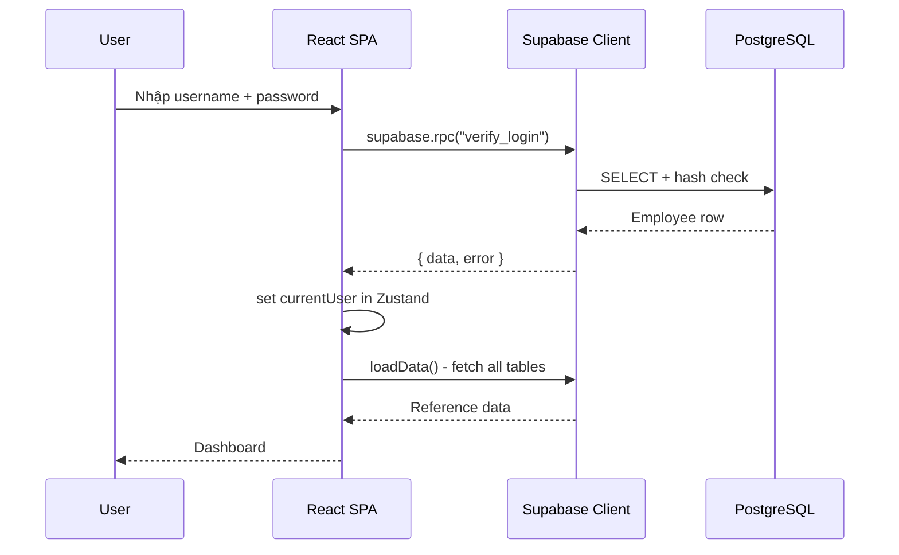
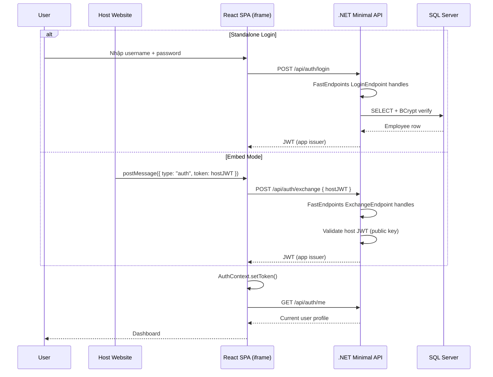

# Business Requirements Document (BRD) - QLNP-TTCDS Migration

**Document Status:** Draft | **Version:** 1.0 | **Date:** 2026-05-12

---

## 1. Tổng quan

### 1.1 Mục tiêu

- **Mục tiêu tổng quát**: Chuyển đổi hệ thống QLNP-TTCDS từ kiến trúc Supabase (BaaS PostgreSQL) + React SPA sang kiến trúc .NET 9 + FastEndpoints + Vertical Slice Architecture + SQL Server + React Frontend, đồng thời bổ sung khả năng nhúng (embed) app vào website khác qua iframe.

- **Mục tiêu cụ thể**:
  - Thay thế hoàn toàn Supabase bằng .NET 9 FastEndpoints + Vertical Slice Architecture + Dapper + SQL Server, giữ nguyên toàn bộ logic nghiệp vụ
  - Hỗ trợ dual auth mode: đăng nhập trực tiếp (standalone) + nhận JWT từ host website (embed)
  - Giữ nguyên UI/UX hiện tại, refactor dần frontend để loại bỏ dependency Supabase
  - Hoàn thành migration không làm gián đoạn hoạt động của TTCDS

### 1.2 Phạm vi

- **Trong phạm vi**:
  - Thiết kế và triển khai .NET 9 FastEndpoints API theo Vertical Slice Architecture với 19+ endpoints (auth, departments, employees, leave-types, leave-requests, leave-balances, config)
  - Tổ chức code theo feature slices: mỗi feature (Login, CreateLeave, ApproveLeave, ...) là một vertical slice chứa Endpoint + Request + Response + Validator + Handler
  - Migration database từ PostgreSQL sang SQL Server (6 tables: departments, employees, leave_types, leave_balances, leave_requests, leave_config)
  - Chuyển đổi password từ plaintext sang BCrypt hash
  - Refactor frontend: thay Supabase client bằng fetch-based API layer, JWT auth context
  - Hỗ trợ PostMessage giao tiếp giữa host website và iframe để nhận JWT
  - Loại bỏ package Supabase, thư mục integrations/supabase/

- **Ngoài phạm vi**:
  - Thay đổi giao diện người dùng (UI/UX)
  - Bổ sung tính năng nghiệp vụ mới ngoài những gì đã có
  - SSO / OAuth integration với hệ thống bên ngoài (ngoại trừ JWT exchange từ host)
  - Multi-tenancy

---

## 2. Stakeholder

| Vai trò | Tên/Phòng ban | Trách nhiệm | Mức độ quan tâm |
|---------|----------------|-------------|-----------------|
| Project Sponsor | Ban Giám đốc TTCDS | Phê duyệt dự án, cấp ngân sách | High |
| Product Owner | TTCDS | Xác nhận yêu cầu nghiệp vụ, nghiệm thu | High |
| Business Users | CB.PCM, LD.PCM, GD.PGD | Sử dụng hệ thống hàng ngày | High |
| System Admin | QTHT | Quản lý cấu hình, vận hành hệ thống | Medium |
| Development Team | Dev team | Thiết kế, phát triển, kiểm thử | High |
| Host Website Team | Đối tác ngoài | Cung cấp JWT, public key endpoint cho validation | Medium |

---

## 3. Business Requirement

### 3.1 Yêu cầu nghiệp vụ

| ID | Yêu cầu | Mức độ ưu tiên | Mô tả chi tiết |
|----|---------|----------------|----------------|
| BR-001 | Giữ nguyên toàn bộ chức năng nghiệp vụ hiện tại | High | Tạo/quản lý đơn nghỉ phép, phê duyệt 2 cấp, theo dõi lịch, tổng hợp, báo cáo, giám sát vi phạm, cấu hình |
| BR-002 | Hỗ trợ đăng nhập độc lập | High | Người dùng đăng nhập bằng username + password qua form login, nhận JWT từ .NET API |
| BR-003 | Hỗ trợ nhúng vào host website | High | App chạy trong iframe, nhận JWT từ host qua postMessage, tự động xác thực không cần login lại |
| BR-004 | Bảo mật dữ liệu người dùng | High | Mã hóa password bằng BCrypt, không lưu plaintext như hiện tại |
| BR-005 | Tương thích dữ liệu hiện có | High | Migrate toàn bộ dữ liệu từ PostgreSQL sang SQL Server không mất mát, giữ nguyên quan hệ khóa ngoại |
| BR-006 | Duy trì quy trình phê duyệt 2 cấp | High | LD.PCM → GD.PGD, theo approval_config, state machine giữ nguyên |

### 3.2 Vấn đề cần giải quyết

- **Phụ thuộc Supabase**: App gắn chặt với Supabase BaaS, không thể triển khai on-premise hoặc trên hạ tầng riêng của TTCDS
- **Không thể nhúng**: Kiến trúc hiện tại không hỗ trợ embed vào website khác, hạn chế tích hợp với hệ sinh thái của đơn vị
- **Password plaintext**: Supabase lưu password dang plaintext, không đạt yêu cầu bảo mật nội bộ
- **Hạn chế mở rộng**: PostgreSQL trên Supabase free tier có giới hạn, khó mở rộng khi số lượng người dùng tăng

### 3.3 Giá trị mang lại

- **Độc lập hạ tầng**: Làm chủ toàn bộ stack, triển khai được trên hạ tầng riêng (on-premise hoặc cloud)
- **Tích hợp hệ sinh thái**: Embed vào website nội bộ của đơn vị, người dùng không cần đăng nhập lại
- **Bảo mật nâng cao**: BCrypt hash password, JWT validation 2 issuer, đạt chuẩn bảo mật nội bộ
- **Hiệu năng**: Dapper + SQL Server cho phép tối ưu query, không giới hạn như Supabase free tier

---

## 4. Business Process

### 4.1 Kiến trúc hiện tại (AS-IS)

```
Browser (React SPA)
    │
    │ HTTPS (REST + RPC)
    v
Supabase Cloud
    ├── PostgreSQL (RLS + RPC functions)
    └── SECURITY DEFINER for verify_login
```



**Điểm nghẽn / Vấn đề**:
- Toàn bộ business logic nằm trong PostgreSQL RPC/RPC functions - khó debug, khó test
- Không có API server trung gian - client gọi trực tiếp Supabase, lộ cấu trúc DB
- Không thể embed vào website khác
- Password lưu plaintext

### 4.2 Kiến trúc đề xuất (TO-BE)

```
Host Website
  └─ iframe ─ React App
       ├─ AuthContext (JWT: own or host)
       ├─ Zustand Store
       └─ api/client.ts (fetch + JWT intercept)
            │
            ▼ POST/GET /api/*
ASP.NET 9 + FastEndpoints (Vertical Slice Architecture)
  ├─ JwtMiddleware (own + host issuer)
  ├─ Features/
  │   ├─ Auth/
  │   │   ├─ Login/        (LoginEndpoint + LoginRequest + LoginResponse + LoginValidator)
  │   │   ├─ Exchange/     (ExchangeEndpoint + ExchangeRequest + ExchangeResponse)
  │   │   └─ Me/           (MeEndpoint)
  │   ├─ Employees/        (List/Create/Update/Delete endpoints)
  │   ├─ Departments/      (List/Create/Update/Delete endpoints)
  │   ├─ LeaveRequests/    (List/Create/Update/Approve/Reject/Cancel endpoints)
  │   ├─ LeaveBalances/    (Summary/My endpoints)
  │   └─ Config/           (Get/Put endpoints)
  ├─ Data/                 (Dapper queries, IDbConnection factory)
  └─ SQL Server



**Cải tiến chính**:
- API server trung gian che giấu cấu trúc DB, tập trung business logic theo từng vertical slice
- **FastEndpoints**: Mỗi endpoint là một class riêng (REPR pattern: Request-EndPoint-Response), code rõ ràng, dễ test từng endpoint độc lập
- **Vertical Slice Architecture**: Code tổ chức theo feature thay vì layer ngang. Mỗi feature slice (Login, CreateLeave, ApproveLeave...) chứa endpoint + request + response + validator + handler — giảm coupling, dễ maintain
- Dual auth: tự đăng nhập hoặc nhận JWT từ host
- BCrypt hash password, JWT với 2 issuer validation
- Dapper cho phép viết SQL thuần, tối ưu hiệu năng
- Frontend tách biệt hoàn toàn với backend qua REST API

---

## 5. Functional Requirement

### 5.1 Nhóm chức năng: Authentication

| ID | Chức năng | Mô tả | Độ ưu tiên | Phụ thuộc |
|----|-----------|-------|------------|-----------|
| FR-001 | Đăng nhập bằng username/password | POST /api/auth/login, trả về JWT | High | BCrypt hash employee password |
| FR-002 | Trao đổi JWT từ host | POST /api/auth/exchange, validate host JWT → app JWT | High | Host public key endpoint |
| FR-003 | Lấy thông tin người dùng hiện tại | GET /api/auth/me, trả về profile từ JWT | High | JWT middleware |
| FR-004 | JWT middleware | Validate token từ 2 issuer (own + host), attach user claims | High | — |
| FR-005 | Nhận JWT từ host qua postMessage | AuthContext listener: window.addEventListener("message") | High | Host gửi đúng format |

### 5.2 Nhóm chức năng: Employee Management

| ID | Chức năng | Mô tả | Độ ưu tiên | Phụ thuộc |
|----|-----------|-------|------------|-----------|
| FR-010 | Danh sách nhân viên | GET /api/employees, filter by department | High | — |
| FR-011 | Chi tiết nhân viên | GET /api/employees/{id} | High | — |
| FR-012 | Tạo nhân viên | POST /api/employees | High | department_id FK |
| FR-013 | Cập nhật nhân viên | PUT /api/employees/{id} | High | — |
| FR-014 | Xóa/vô hiệu nhân viên | DELETE /api/employees/{id} | Medium | Không xóa nếu có leave_requests |

### 5.3 Nhóm chức năng: Department Management

| ID | Chức năng | Mô tả | Độ ưu tiên | Phụ thuộc |
|----|-----------|-------|------------|-----------|
| FR-020 | Danh sách phòng ban | GET /api/departments | High | — |
| FR-021 | Tạo phòng ban | POST /api/departments | Medium | — |
| FR-022 | Cập nhật phòng ban | PUT /api/departments/{id} | Medium | — |
| FR-023 | Xóa phòng ban | DELETE /api/departments/{id} | Low | Không có employees FK |

### 5.4 Nhóm chức năng: Leave Types

| ID | Chức năng | Mô tả | Độ ưu tiên | Phụ thuộc |
|----|-----------|-------|------------|-----------|
| FR-030 | Danh sách loại nghỉ phép | GET /api/leave-types | High | — |
| FR-031 | CRUD loại nghỉ phép | POST/PUT/DELETE /api/leave-types | Medium | Không xóa nếu có requests |

### 5.5 Nhóm chức năng: Leave Requests (Core)

| ID | Chức năng | Mô tả | Độ ưu tiên | Phụ thuộc |
|----|-----------|-------|------------|-----------|
| FR-040 | Danh sách đơn nghỉ phép | GET /api/leave-requests, role-based filtering | High | Auth JWT |
| FR-041 | Tạo đơn nghỉ phép | POST /api/leave-requests, validate business days, phát hiện trùng lịch | High | leave-balances check |
| FR-042 | Cập nhật đơn | PUT /api/leave-requests/{id}, chỉ khi status=pending | High | — |
| FR-043 | Phê duyệt / từ chối cấp 1 | PUT /api/leave-requests/{id}, LD.PCM → approved_leader/rejected | High | approval_config |
| FR-044 | Phê duyệt / từ chối cấp 2 | PUT /api/leave-requests/{id}, GD.PGD → approved_director/rejected | High | FR-043 |
| FR-045 | Hủy đơn | DELETE /api/leave-requests/{id}, employee tự hủy | Medium | Status = pending/approved_leader |

### 5.6 Nhóm chức năng: Leave Balances

| ID | Chức năng | Mô tả | Độ ưu tiên | Phụ thuộc |
|----|-----------|-------|------------|-----------|
| FR-050 | Tổng hợp số dư phép | GET /api/leave-balances, all employees (GD.PGD) | High | Auth |
| FR-051 | Số dư phép của tôi | GET /api/leave-balances/my | High | Auth |
| FR-052 | Trừ ngày phép khi duyệt | Tự động cập nhật used_days khi approved_director | High | FR-044 |

### 5.7 Nhóm chức năng: System Config

| ID | Chức năng | Mô tả | Độ ưu tiên | Phụ thuộc |
|----|-----------|-------|------------|-----------|
| FR-060 | Đọc cấu hình | GET /api/config | High | — |
| FR-061 | Cập nhật cấu hình | PUT /api/config/{key} | Medium | QTHT role |

### 5.8 Nhóm chức năng: Embedding

| ID | Chức năng | Mô tả | Độ ưu tiên | Phụ thuộc |
|----|-----------|-------|------------|-----------|
| FR-070 | Nhận diện chế độ embed | Frontend detect if trong iframe (window.self !== window.top) | High | — |
| FR-071 | Giao tiếp với host | postMessage listener nhận { type: "auth", token } | High | Host gửi message |
| FR-072 | Tự động exchange token | Khi nhận host JWT → POST /api/auth/exchange → set app JWT | High | FR-002 |

### 5.9 User Stories

| ID | User Story | Acceptance Note |
|----|------------|-----------------|
| US-001 | Là CB.PCM, tôi muốn đăng nhập bằng username/password để truy cập hệ thống | Login thành công → redirect dashboard, JWT lưu trong AuthContext |
| US-002 | Là CB.PCM, tôi muốn tạo đơn nghỉ phép mới để gửi lên cấp trên phê duyệt | Form gồm: loại phép, ngày, lý do; tự động tính business days |
| US-003 | Là LD.PCM, tôi muốn xem danh sách đơn chờ duyệt của nhân viên trong phòng | Chỉ hiện đơn của nhân viên thuộc phòng mình |
| US-004 | Là GD.PGD, tôi muốn phê duyệt cuối cùng các đơn đã được LD.PCM duyệt | Hiện đơn status=approved_leader, duyệt → approved_director |
| US-005 | Là GD.PGD, tôi muốn xem báo cáo tổng hợp theo phòng ban | Dashboard với biểu đồ, KPI cards |
| US-006 | Là QTHT, tôi muốn cấu hình loại nghỉ phép và quy trình phê duyệt | CRUD leave_types + approval_config |
| US-007 | Là người dùng trên host website, tôi muốn mở app QLNP trong iframe mà không cần đăng nhập lại | Host gửi JWT qua postMessage → app tự xác thực |
| US-008 | Là QTHT, tôi muốn migrate dữ liệu từ PostgreSQL sang SQL Server không mất mát | Script migrate chạy 1 lần, verify row count từng bảng |

---

## 6. Non-functional Requirement

| ID | Loại | Yêu cầu | Metric |
|----|------|---------|--------|
| NFR-001 | Performance | Page load < 3s, API response < 500ms (P95) | Load testing với 50 concurrent users |
| NFR-002 | Security | Password BCrypt hash (cost 12), JWT HS256 cho app issuer, RS256 cho host issuer | OWASP Top 10 compliance |
| NFR-003 | Security | JWT expiry 8h (giờ hành chính), refresh không yêu cầu (re-login sau khi hết hạn) | Token exp claim |
| NFR-004 | Availability | 99% trong giờ hành chính (8h-17h, T2-T6) | Uptime monitoring |
| NFR-005 | Data Integrity | FK constraints, UNIQUE constraints giữ nguyên từ PostgreSQL | Migration verify script |
| NFR-006 | Compatibility | Frontend chạy trên Chrome, Firefox, Edge (latest 2 versions) | Cross-browser testing |
| NFR-007 | Usability | Giao diện tiếng Việt, responsive mobile + desktop, WCAG 2.1 A | Manual QA |
| NFR-008 | Maintainability | Code backend chia service class rõ ràng, frontend tách API layer riêng | Code review |
| NFR-009 | Migration | Script migrate chạy < 5 phút cho ~1000 records, zero downtime | Test trên staging trước |

---

## 7. Business Rules

| ID | Quy tắc | Mô tả | Ngoại lệ |
|----|---------|-------|-----------|
| BRULE-001 | Tính ngày nghỉ | Chỉ tính ngày làm việc (Mon-Fri), không tính thứ 7, CN | Ngày lễ (chưa implement) |
| BRULE-002 | Phát hiện trùng lịch | Không cho tạo đơn nếu có đơn đã duyệt (approved_leader/approved_director) trùng ngày | — |
| BRULE-003 | Phê duyệt 2 cấp | pending → LD.PCM → approved_leader → GD.PGD → approved_director | Nếu approval_config chỉ có 1 level → pending → approved_director luôn |
| BRULE-004 | Phân quyền theo role | CB.PCM: xem đơn của mình; LD.PCM: xem đơn của phòng; GD.PGD: xem tất cả; QTHT: cấu hình | Dựa theo JWT claims |
| BRULE-005 | Giới hạn ngày phép | Mặc định 12 ngày/năm, theo dõi vi phạm khi vượt quá | Cấu hình được trong leave_config |
| BRULE-006 | Hủy đơn | Chỉ hủy được khi status = pending hoặc approved_leader | Không hủy được khi đã approved_director |
| BRULE-007 | Chỉnh sửa đơn | Chỉ sửa được khi status = pending | — |
| BRULE-008 | Password policy | BCrypt hash với cost factor 12, không lưu plaintext | — |
| BRULE-009 | JWT exchange validation | Host JWT phải được ký bởi host issuer, verify bằng public key | Nếu host public key không có → không exchange được |

---

## 8. Assumption & Constraint

### 8.1 Giả định (Assumptions)

| ID | Giả định | Rủi ro nếu sai |
|----|----------|----------------|
| ASM-001 | Host website có sẵn public key / JWKS endpoint để validate JWT | Không thể validate host JWT → embed mode không hoạt động |
| ASM-002 | SQL Server instance đã có sẵn hoặc được cấp phép cài đặt | Phải xin ngân sách / license SQL Server |
| ASM-003 | Dữ liệu hiện tại (< 1000 employees, < 5000 leave_requests) đủ nhỏ để migrate nhanh | Migration lâu hơn dự kiến nếu dữ liệu lớn |
| ASM-004 | Host website gửi postMessage đúng format: { type: "auth", token: string } | Frontend không nhận được token → user phải login manually |
| ASM-005 | Toàn bộ dữ liệu hiện tại tương thích với SQL Server type mapping | Một số row bị lỗi convert → phải xử lý thủ công |
| ASM-006 | Người dùng chấp nhận đăng nhập lại sau khi migration (password được re-hash) | Có thể gây phiền hà nếu số lượng user lớn |

### 8.2 Ràng buộc (Constraints)

| ID | Ràng buộc | Nguồn | Ảnh hưởng |
|----|-----------|-------|-----------|
| CST-001 | Phải dùng .NET 9 + FastEndpoints + Vertical Slice Architecture + Dapper (user preference) | Tech | Không dùng Minimal API inline hay Controllers truyền thống; tổ chức code theo feature slices, mỗi endpoint là 1 class độc lập |
| CST-002 | Phải giữ nguyên UI/UX hiện tại | Business | Không thay đổi component tree, chỉ thay data layer |
| CST-003 | Không làm gián đoạn hoạt động của TTCDS | Business | Phải có kế hoạch cut-over rõ ràng, rollback plan |
| CST-004 | SQL Server license cost | Budget | Có thể dùng SQL Server Express (free, giới hạn 10GB) |
| CST-005 | Frontend vẫn là SPA, không SSR | Tech | Deploy static files, không cần Node server |

---

## 9. Acceptance Criteria

### 9.1 Tiêu chí nghiệm thu tổng thể

- [ ] Toàn bộ 19+ API endpoints hoạt động đúng spec, response format consistent
- [ ] Migration hoàn tất: 6 tables, toàn bộ rows, FK constraints khớp PostgreSQL
- [ ] Password được BCrypt hash, không còn plaintext
- [ ] Frontend chạy không có Supabase dependency (`grep -r "supabase" src/` trả về 0 kết quả)
- [ ] Auth flow: login → JWT → API calls có Authorization header
- [ ] Embed flow: host postMessage → exchange JWT → auto-login
- [ ] Approval workflow 2 cấp hoạt động đúng state machine
- [ ] Business days calculation chính xác (bỏ T7, CN)
- [ ] UI giữ nguyên, không thay đổi layout/hiển thị so với bản hiện tại
- [ ] Test suite pass (cập nhật test sau migration)

### 9.2 Tiêu chí theo chức năng

| ID | Chức năng | Tiêu chí | Phương pháp kiểm tra |
|----|-----------|----------|---------------------|
| AC-001 | Login standalone | Đăng nhập đúng username/password → nhận JWT → redirect / | Manual test + API test |
| AC-002 | Login sai | Sai password → 401, hiển thị lỗi "Sai tên đăng nhập hoặc mật khẩu" | Manual test |
| AC-003 | JWT exchange | Gửi host JWT → trả về app JWT → gọi /api/auth/me thành công | API test |
| AC-004 | JWT hết hạn | Gọi API với token hết hạn → 401 → frontend redirect /login | Manual test |
| AC-005 | Tạo đơn nghỉ phép | Chọn loại phép + ngày + lý do → POST → hiện trong danh sách | E2E test |
| AC-006 | Phát hiện trùng lịch | Tạo đơn trùng ngày với đơn đã duyệt → 409 Conflict | API test |
| AC-007 | Phê duyệt cấp 1 | LD.PCM duyệt → status = approved_leader, approved_by = LD.PCM id | E2E test |
| AC-008 | Phê duyệt cấp 2 | GD.PGD duyệt → status = approved_director, used_days tăng | E2E test |
| AC-009 | Từ chối | Từ chối + lý do → status = rejected, rejected_reason lưu | E2E test |
| AC-010 | Hủy đơn | Employee hủy đơn pending → status = cancelled | E2E test |
| AC-011 | Role filtering | CB.PCM chỉ thấy đơn của mình, LD.PCM thấy đơn của phòng | API test |
| AC-012 | Số dư phép | Sau khi approved_director, used_days cập nhật đúng | API test |
| AC-013 | Embed detect | Mở app trong iframe → hiển thị chế độ embed (ẩn login form nếu có token host) | Manual test |
| AC-014 | Host postMessage | Host gửi { type: "auth", token } → app nhận, gọi exchange, vào dashboard | Integration test |
| AC-015 | DB Migration | Row count mỗi bảng SQL Server = PostgreSQL, FK relationships giữ nguyên | Migration verify script |
| AC-016 | BCrypt verify | Password cũ migrate → hash mới → user đăng nhập được bằng password cũ | Migration test |

---

## Appendix A: Database Migration Mapping

| PostgreSQL Type | SQL Server Type |
|-----------------|-----------------|
| UUID | UNIQUEIDENTIFIER |
| TEXT | NVARCHAR(MAX) |
| TIMESTAMPTZ | DATETIME2 |
| NUMERIC(5,1) | DECIMAL(5,1) |
| BOOLEAN | BIT |

## Appendix B: API Endpoints Summary (FastEndpoints)

Các endpoint được tổ chức theo Vertical Slice Architecture — mỗi endpoint là một class kế thừa `Endpoint<TRequest, TResponse>`:

| Method | Path | Endpoint Class | Auth | Role |
|--------|------|----------------|------|------|
| POST | /api/auth/login | LoginEndpoint | No | — |
| POST | /api/auth/exchange | ExchangeEndpoint | No (host JWT) | — |
| GET | /api/auth/me | MeEndpoint | App JWT | All |
| GET | /api/departments | ListDepartmentsEndpoint | App JWT | QTHT |
| POST | /api/departments | CreateDepartmentEndpoint | App JWT | QTHT |
| PUT | /api/departments/{id} | UpdateDepartmentEndpoint | App JWT | QTHT |
| DELETE | /api/departments/{id} | DeleteDepartmentEndpoint | App JWT | QTHT |
| GET | /api/employees | ListEmployeesEndpoint | App JWT | QTHT |
| POST | /api/employees | CreateEmployeeEndpoint | App JWT | QTHT |
| PUT | /api/employees/{id} | UpdateEmployeeEndpoint | App JWT | QTHT |
| DELETE | /api/employees/{id} | DeleteEmployeeEndpoint | App JWT | QTHT |
| GET | /api/leave-types | ListLeaveTypesEndpoint | App JWT | QTHT |
| POST | /api/leave-types | CreateLeaveTypeEndpoint | App JWT | QTHT |
| PUT | /api/leave-types/{id} | UpdateLeaveTypeEndpoint | App JWT | QTHT |
| DELETE | /api/leave-types/{id} | DeleteLeaveTypeEndpoint | App JWT | QTHT |
| GET | /api/leave-requests | ListLeaveRequestsEndpoint | App JWT | All (role-filtered) |
| POST | /api/leave-requests | CreateLeaveRequestEndpoint | App JWT | CB.PCM, LD.PCM |
| PUT | /api/leave-requests/{id} | UpdateLeaveRequestEndpoint | App JWT | Owner (pending only) |
| PUT | /api/leave-requests/{id}/approve | ApproveLeaveRequestEndpoint | App JWT | LD.PCM, GD.PGD |
| PUT | /api/leave-requests/{id}/reject | RejectLeaveRequestEndpoint | App JWT | LD.PCM, GD.PGD |
| DELETE | /api/leave-requests/{id} | CancelLeaveRequestEndpoint | App JWT | Owner |
| GET | /api/leave-balances | ListLeaveBalancesEndpoint | App JWT | GD.PGD |
| GET | /api/leave-balances/my | MyLeaveBalanceEndpoint | App JWT | All |
| GET | /api/config | GetConfigEndpoint | App JWT | All |
| PUT | /api/config/{key} | UpdateConfigEndpoint | App JWT | QTHT |

## Appendix C: Phase Breakdown

| Phase | Name | Priority | Est. Tasks |
|-------|------|----------|------------|
| 1 | .NET Backend + SQL Server (FastEndpoints + Vertical Slice Architecture) | P0 | 12-15 |
| 2 | Frontend Refactor (bỏ Supabase) | P1 | 6-8 |
| 3 | Standalone Embedding | P2 | 5-7 |

## Appendix D: Vertical Slice Feature Structure

```
Features/
├── Auth/
│   ├── Login/
│   │   ├── LoginEndpoint.cs       (Endpoint<LoginRequest, LoginResponse>)
│   │   ├── LoginRequest.cs        (record with FluentValidation)
│   │   ├── LoginResponse.cs       (JWT + user profile)
│   │   └── LoginValidator.cs      (FluentValidation rules)
│   ├── Exchange/
│   │   ├── ExchangeEndpoint.cs
│   │   ├── ExchangeRequest.cs
│   │   └── ExchangeResponse.cs
│   └── Me/
│       └── MeEndpoint.cs
├── Employees/
│   ├── List/ListEmployeesEndpoint.cs
│   ├── Create/CreateEmployeeEndpoint.cs
│   ├── Update/UpdateEmployeeEndpoint.cs
│   └── Delete/DeleteEmployeeEndpoint.cs
├── Departments/
│   ├── List/ListDepartmentsEndpoint.cs
│   ├── Create/CreateDepartmentEndpoint.cs
│   ├── Update/UpdateDepartmentEndpoint.cs
│   └── Delete/DeleteDepartmentEndpoint.cs
├── LeaveRequests/
│   ├── List/ListLeaveRequestsEndpoint.cs
│   ├── Create/CreateLeaveRequestEndpoint.cs
│   ├── Update/UpdateLeaveRequestEndpoint.cs
│   ├── Approve/ApproveLeaveRequestEndpoint.cs
│   ├── Reject/RejectLeaveRequestEndpoint.cs
│   └── Cancel/CancelLeaveRequestEndpoint.cs
├── LeaveBalances/
│   ├── List/ListLeaveBalancesEndpoint.cs
│   └── My/MyLeaveBalanceEndpoint.cs
└── Config/
    ├── Get/GetConfigEndpoint.cs
    └── Update/UpdateConfigEndpoint.cs
```

**FastEndpoints Pipeline**: `Request → Validator (FluentValidation) → PreProcessor → Endpoint.HandleAsync() → PostProcessor → Response`

**Cross-cutting concerns** (dùng chung giữa các slices):
- `Data/DbConnectionFactory.cs` — SQL Server IDbConnection factory
- `Auth/JwtService.cs` — Tạo + validate JWT (own issuer + host issuer)
- `Auth/CurrentUserService.cs` — Lấy thông tin user từ HttpContext
- `Middleware/JwtMiddleware.cs` — Tự động validate token trước mỗi request
