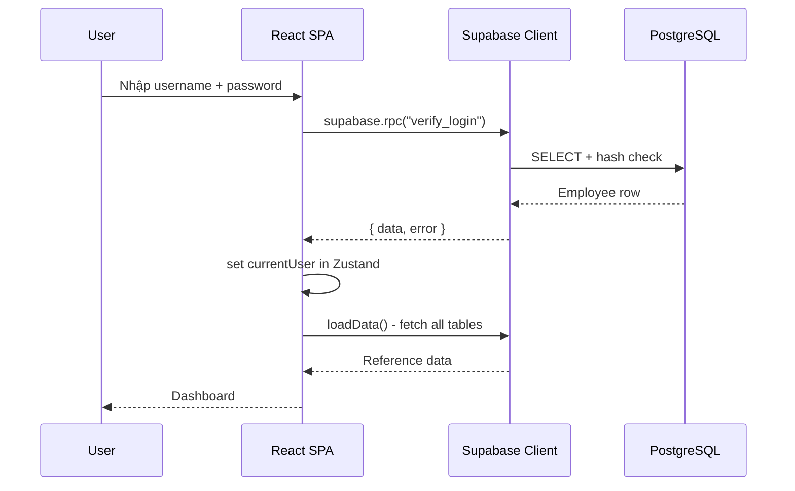
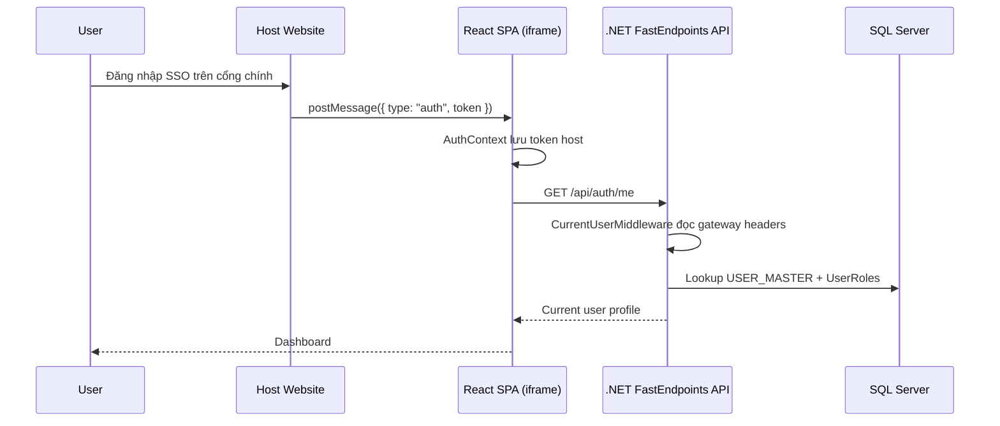

# Business Requirements Document (BRD) - QLNP-TTCDS Migration

**Document Status:** Draft | **Version:** 1.1 | **Date:** 2026-05-14

---

## 1. Tổng quan

### 1.1 Mục tiêu

- **Mục tiêu tổng quát**: Chuyển đổi hệ thống QLNP-TTCDS từ kiến trúc Supabase (BaaS PostgreSQL) + React SPA sang kiến trúc .NET 9 + FastEndpoints + Vertical Slice Pattern (VSP) + EF Core 9 + SQL Server + React Frontend, đồng thời hỗ trợ chạy trong iframe của cổng SSO/host website.

- **Mục tiêu cụ thể**:
  - Thay thế hoàn toàn Supabase bằng .NET 9 FastEndpoints + VSP + EF Core 9 + SQL Server, giữ nguyên toàn bộ logic nghiệp vụ
  - Hỗ trợ xác thực qua SSO/gateway: host website gửi token qua iframe/postMessage, API resolve người dùng hiện tại qua gateway headers; dev mode có fallback nội bộ
  - Giữ nguyên UI/UX hiện tại, refactor dần frontend để loại bỏ dependency Supabase
  - Hoàn thành migration không làm gián đoạn hoạt động của TTCDS

### 1.2 Phạm vi

- **Trong phạm vi**:
  - Thiết kế và triển khai .NET 9 FastEndpoints API theo VSP với các feature slices: Auth/Me, LeaveTypes, LeaveRequests, LeaveBalances, Config/UserRole
  - Tổ chức code theo feature slices: mỗi use case (Me, CreateLeaveRequest, ApproveLeaveRequest, ...) là một vertical slice chứa Endpoint + Request + Response + Validator nếu cần
  - Migration dữ liệu nghiệp vụ từ Supabase/PostgreSQL sang SQL Server; dùng `USER_MASTER` và `DM_DONVI` hiện hữu làm system tables read-only
  - Không lưu password trong QLNP; xác thực production do cổng SSO/gateway đảm nhiệm
  - Refactor frontend: thay Supabase client bằng fetch-based API layer và AuthContext dùng token host/current user
  - Hỗ trợ postMessage giao tiếp giữa host website và iframe để nhận token host và gọi `/api/auth/me`
  - Loại bỏ package Supabase, thư mục integrations/supabase/

- **Ngoài phạm vi**:
  - Thay đổi giao diện người dùng (UI/UX)
  - Bổ sung tính năng nghiệp vụ mới ngoài những gì đã có
  - Xây dựng SSO/OAuth provider mới; QLNP chỉ tiêu thụ token/header từ host/gateway hiện hữu
  - Multi-tenancy

---

## 2. Stakeholder

| Vai trò | Tên/Phòng ban | Trách nhiệm | Mức độ quan tâm |
|---------|----------------|-------------|-----------------|
| Project Sponsor | Ban Giám đốc TTCDS | Phê duyệt dự án, cấp ngân sách | High |
| Product Owner | TTCDS | Xác nhận yêu cầu nghiệp vụ, nghiệm thu | High |
| Business Users | CB.PCM, LD.PCM, GD.PGD | Sử dụng hệ thống hàng ngày | High |
| System Admin | QTHT | Quản lý cấu hình, vận hành hệ thống | Medium |
| Development Team | Dev team | Thiết kế, phát triển, kiểm thử | High |
| Host Website Team | Đối tác ngoài | Cung cấp iframe container, token qua postMessage, gateway headers khi gọi API | Medium |

---

## 3. Business Requirement

### 3.1 Yêu cầu nghiệp vụ

| ID | Yêu cầu | Mức độ ưu tiên | Mô tả chi tiết |
|----|---------|----------------|----------------|
| BR-001 | Giữ nguyên toàn bộ chức năng nghiệp vụ hiện tại | High | Tạo/quản lý đơn nghỉ phép, phê duyệt 2 cấp, theo dõi lịch, tổng hợp, báo cáo, giám sát vi phạm, cấu hình |
| BR-002 | Hỗ trợ xác thực qua SSO/gateway | High | Người dùng truy cập từ cổng chính, React app nhận token host qua iframe/postMessage, API resolve user qua gateway headers |
| BR-003 | Hỗ trợ nhúng vào host website | High | App chạy trong iframe, không yêu cầu form đăng nhập riêng trong QLNP |
| BR-004 | Bảo mật dữ liệu người dùng | High | QLNP không lưu password; phân quyền theo current user do gateway/API middleware resolve |
| BR-005 | Tương thích dữ liệu hiện có | High | Migrate dữ liệu nghiệp vụ sang SQL Server không mất mát, giữ nguyên quan hệ khóa ngoại với system tables |
| BR-006 | Duy trì quy trình phê duyệt 2 cấp | High | LD.PCM → GD.PGD, theo `LeaveConfigs`, state machine giữ nguyên |

### 3.2 Vấn đề cần giải quyết

- **Phụ thuộc Supabase**: App gắn chặt với Supabase BaaS, không thể triển khai on-premise hoặc trên hạ tầng riêng của TTCDS
- **Không thể nhúng**: Kiến trúc hiện tại không hỗ trợ embed vào website khác, hạn chế tích hợp với hệ sinh thái của đơn vị
- **Password plaintext**: Mô hình cũ có rủi ro lưu/kiểm tra mật khẩu trong app; kiến trúc mới chuyển xác thực ra SSO/gateway
- **Hạn chế mở rộng**: PostgreSQL trên Supabase free tier có giới hạn, khó mở rộng khi số lượng người dùng tăng

### 3.3 Giá trị mang lại

- **Độc lập hạ tầng**: Làm chủ toàn bộ stack, triển khai được trên hạ tầng riêng (on-premise hoặc cloud)
- **Tích hợp hệ sinh thái**: Embed vào website nội bộ của đơn vị, người dùng không cần đăng nhập lại
- **Bảo mật nâng cao**: Không lưu mật khẩu trong QLNP, current user resolve tập trung qua gateway, role kiểm tra tại API
- **Hiệu năng**: EF Core + SQL Server cho phép tối ưu query, index và migration trên hạ tầng do đơn vị kiểm soát

---

## 4. Business Process

### 4.1 Kiến trúc hiện tại (AS-IS)

```
Browser (React SPA)
    │
    │ HTTPS (REST + RPC)
    v
Supabase Cloud
    ├── PostgreSQL (RLS + RPC functions)
    └── SECURITY DEFINER for verify_login
```



**Điểm nghẽn / Vấn đề**:
- Toàn bộ business logic nằm trong PostgreSQL RPC/RPC functions - khó debug, khó test
- Không có API server trung gian - client gọi trực tiếp Supabase, lộ cấu trúc DB
- Không thể embed vào website khác
- Password lưu plaintext

### 4.2 Kiến trúc đề xuất (TO-BE)

```
Host Website
  └─ iframe ─ React App
       ├─ AuthContext (host token + current user)
       ├─ Zustand Store
       └─ api/client.ts (fetch + Bearer token)
            │
            ▼ POST/GET /api/*
ASP.NET 9 + FastEndpoints (Vertical Slice Pattern)
  ├─ CurrentUserMiddleware (gateway headers + dev fallback)
  ├─ Features/
  │   ├─ Auth/
  │   │   └─ Me/           (MeEndpoint)
  │   ├─ LeaveRequests/    (List/Create/Update/Approve/Reject/Cancel endpoints)
  │   ├─ LeaveTypes/       (List/Create/Update/Delete endpoints)
  │   ├─ LeaveBalances/    (List/My endpoints)
  │   └─ Config/           (Get/Update/UserRole endpoints)
  ├─ Data/AppDbContext     (EF Core 9)
  └─ SQL Server



**Cải tiến chính**:
- API server trung gian che giấu cấu trúc DB, tập trung business logic theo từng vertical slice
- **FastEndpoints**: Mỗi endpoint là một class riêng (REPR pattern: Request-EndPoint-Response), code rõ ràng, dễ test từng endpoint độc lập
- **Vertical Slice Pattern (VSP)**: Code tổ chức theo use case thay vì layer ngang. Mỗi slice (Me, CreateLeaveRequest, ApproveLeaveRequest...) chứa endpoint + request + response + validator/handler logic — giảm coupling, dễ maintain
- **Gateway auth**: QLNP tiêu thụ token/header từ host, không tự quản lý mật khẩu người dùng
- **CurrentUserMiddleware**: Resolve user từ gateway headers hoặc dev fallback, endpoint đọc current user từ `HttpContext.Items`
- **EF Core 9**: Quản lý SQL Server, migrations cho bảng QLNP, scaffold system tables hiện hữu ở chế độ read-only
- Frontend tách biệt hoàn toàn với backend qua REST API

---

## 5. Functional Requirement

### 5.1 Nhóm chức năng: Authentication

| ID | Chức năng | Mô tả | Độ ưu tiên | Phụ thuộc |
|----|-----------|-------|------------|-----------|
| FR-001 | Nhận token từ host | React AuthContext lắng nghe postMessage `{ type: "auth", token }` và lưu token để gọi API | High | Host gửi đúng format |
| FR-002 | Lấy thông tin người dùng hiện tại | GET /api/auth/me trả về profile từ `CurrentUserMiddleware` | High | Gateway headers hoặc dev fallback |
| FR-003 | Resolve current user | Middleware đọc `X-User-Id`, `X-User-Name`, `X-User-FullName`, lookup `USER_MASTER` + `UserRoles` | High | Gateway/reverse proxy |
| FR-004 | Dev auth fallback | Khi `DevMode:Enabled=true`, API dùng user admin mặc định để phát triển nội bộ | Medium | Chỉ bật local/dev |
| FR-005 | Logout/clear token | Frontend xóa token localStorage và quay về màn hình chờ SSO/login | High | — |

### 5.2 Nhóm chức năng: User/Department Reference

| ID | Chức năng | Mô tả | Độ ưu tiên | Phụ thuộc |
|----|-----------|-------|------------|-----------|
| FR-010 | Tham chiếu người dùng | Đọc thông tin người dùng từ `USER_MASTER` để hiển thị và lọc dữ liệu nghiệp vụ | High | Gateway headers |
| FR-011 | Vai trò người dùng | Quản lý role QLNP qua `UserRoles` trong Config/UserRole slice | High | QTHT |
| FR-012 | Không CRUD nhân viên trong QLNP | Nhân sự thuộc hệ thống nguồn/cổng SSO, QLNP chỉ tham chiếu | High | `USER_MASTER` |

### 5.3 Nhóm chức năng: Department Reference

| ID | Chức năng | Mô tả | Độ ưu tiên | Phụ thuộc |
|----|-----------|-------|------------|-----------|
| FR-020 | Tham chiếu phòng ban | Đọc phòng ban từ `DM_DONVI` để lọc, hiển thị, tổng hợp | High | System table read-only |
| FR-021 | Không CRUD phòng ban trong QLNP | Phòng ban thuộc hệ thống nguồn, không sửa trong module nghỉ phép | High | `DM_DONVI` |

### 5.4 Nhóm chức năng: Leave Types

| ID | Chức năng | Mô tả | Độ ưu tiên | Phụ thuộc |
|----|-----------|-------|------------|-----------|
| FR-030 | Danh sách loại nghỉ phép | GET /api/leave-types | High | — |
| FR-031 | CRUD loại nghỉ phép | POST/PUT/DELETE /api/leave-types | Medium | Không xóa nếu có requests |

### 5.5 Nhóm chức năng: Leave Requests (Core)

| ID | Chức năng | Mô tả | Độ ưu tiên | Phụ thuộc |
|----|-----------|-------|------------|-----------|
| FR-040 | Danh sách đơn nghỉ phép | GET /api/leave-requests, role-based filtering | High | Current user |
| FR-041 | Tạo đơn nghỉ phép | POST /api/leave-requests, validate business days, phát hiện trùng lịch | High | leave-balances check |
| FR-042 | Cập nhật đơn | PUT /api/leave-requests/{id}, chỉ khi status=pending | High | — |
| FR-043 | Phê duyệt / từ chối cấp 1 | PUT /api/leave-requests/{id}, LD.PCM → approved_leader/rejected | High | `LeaveConfigs` |
| FR-044 | Phê duyệt / từ chối cấp 2 | PUT /api/leave-requests/{id}, GD.PGD → approved_director/rejected | High | FR-043 |
| FR-045 | Hủy đơn | DELETE /api/leave-requests/{id}, user tự hủy | Medium | Status = pending/approved_leader |

### 5.6 Nhóm chức năng: Leave Balances

| ID | Chức năng | Mô tả | Độ ưu tiên | Phụ thuộc |
|----|-----------|-------|------------|-----------|
| FR-050 | Tổng hợp số dư phép | GET /api/leave-balances, all users (GD.PGD) | High | Current user |
| FR-051 | Số dư phép của tôi | GET /api/leave-balances/my | High | Current user |
| FR-052 | Trừ ngày phép khi duyệt | Tự động cập nhật used_days khi approved_director | High | FR-044 |

### 5.7 Nhóm chức năng: System Config

| ID | Chức năng | Mô tả | Độ ưu tiên | Phụ thuộc |
|----|-----------|-------|------------|-----------|
| FR-060 | Đọc cấu hình | GET /api/config | High | — |
| FR-061 | Cập nhật cấu hình | PUT /api/config/{key} | Medium | QTHT role |

### 5.8 Nhóm chức năng: Embedding

| ID | Chức năng | Mô tả | Độ ưu tiên | Phụ thuộc |
|----|-----------|-------|------------|-----------|
| FR-070 | Nhận diện chế độ embed | Frontend detect if trong iframe (window.self !== window.top) | High | — |
| FR-071 | Giao tiếp với host | postMessage listener nhận `{ type: "auth", token }` | High | Host gửi message |
| FR-072 | Tự động resolve user | Khi nhận token host → lưu Bearer token → gọi GET /api/auth/me | High | FR-002 |

### 5.9 User Stories

| ID | User Story | Acceptance Note |
|----|------------|-----------------|
| US-001 | Là CB.PCM, tôi muốn truy cập QLNP từ cổng SSO để vào hệ thống không cần đăng nhập lại | Host gửi token → frontend gọi /api/auth/me → redirect dashboard |
| US-002 | Là CB.PCM, tôi muốn tạo đơn nghỉ phép mới để gửi lên cấp trên phê duyệt | Form gồm: loại phép, ngày, lý do; tự động tính business days |
| US-003 | Là LD.PCM, tôi muốn xem danh sách đơn chờ duyệt của nhân viên trong phòng | Chỉ hiện đơn của nhân viên thuộc phòng mình |
| US-004 | Là GD.PGD, tôi muốn phê duyệt cuối cùng các đơn đã được LD.PCM duyệt | Hiện đơn status=approved_leader, duyệt → approved_director |
| US-005 | Là GD.PGD, tôi muốn xem báo cáo tổng hợp theo phòng ban | Dashboard với biểu đồ, KPI cards |
| US-006 | Là QTHT, tôi muốn cấu hình loại nghỉ phép và quy trình phê duyệt | CRUD `LeaveTypes` + `LeaveConfigs` |
| US-007 | Là người dùng trên host website, tôi muốn mở app QLNP trong iframe mà không cần đăng nhập lại | Host gửi token qua postMessage → API resolve current user qua gateway |
| US-008 | Là QTHT, tôi muốn migrate dữ liệu từ PostgreSQL sang SQL Server không mất mát | Script migrate chạy 1 lần, verify row count từng bảng |

---

## 6. Non-functional Requirement

| ID | Loại | Yêu cầu | Metric |
|----|------|---------|--------|
| NFR-001 | Performance | Page load < 3s, API response < 500ms (P95) | Load testing với 50 concurrent users |
| NFR-002 | Security | QLNP không lưu password; gateway/SSO chịu trách nhiệm xác thực, API chỉ nhận current user đã được gateway xác thực | OWASP Top 10 compliance |
| NFR-003 | Security | Token phiên do host/SSO quản lý; QLNP xóa local token khi logout hoặc host yêu cầu | Host session policy |
| NFR-004 | Availability | 99% trong giờ hành chính (8h-17h, T2-T6) | Uptime monitoring |
| NFR-005 | Data Integrity | FK constraints, UNIQUE constraints giữ nguyên từ PostgreSQL | Migration verify script |
| NFR-006 | Compatibility | Frontend chạy trên Chrome, Firefox, Edge (latest 2 versions) | Cross-browser testing |
| NFR-007 | Usability | Giao diện tiếng Việt, responsive mobile + desktop, WCAG 2.1 A | Manual QA |
| NFR-008 | Maintainability | Backend chia theo VSP feature slices, frontend tách API layer riêng | Code review |
| NFR-009 | Migration | Script migrate chạy < 5 phút cho ~1000 records, zero downtime | Test trên staging trước |

---

## 7. Business Rules

| ID | Quy tắc | Mô tả | Ngoại lệ |
|----|---------|-------|-----------|
| BRULE-001 | Tính ngày nghỉ | Chỉ tính ngày làm việc (Mon-Fri), không tính thứ 7, CN | Ngày lễ (chưa implement) |
| BRULE-002 | Phát hiện trùng lịch | Không cho tạo đơn nếu có đơn đã duyệt (approved_leader/approved_director) trùng ngày | — |
| BRULE-003 | Phê duyệt 2 cấp | pending → LD.PCM → approved_leader → GD.PGD → approved_director | Nếu `LeaveConfigs` chỉ có 1 level → pending → approved_director luôn |
| BRULE-004 | Phân quyền theo role | CB.PCM: xem đơn của mình; LD.PCM: xem đơn của phòng; GD.PGD: xem tất cả; QTHT: cấu hình | Dựa theo current user + `UserRoles` |
| BRULE-005 | Giới hạn ngày phép | Mặc định 12 ngày/năm, theo dõi vi phạm khi vượt quá | Cấu hình được trong `LeaveConfigs`/config slice |
| BRULE-006 | Hủy đơn | Chỉ hủy được khi status = pending hoặc approved_leader | Không hủy được khi đã approved_director |
| BRULE-007 | Chỉnh sửa đơn | Chỉ sửa được khi status = pending | — |
| BRULE-008 | Password policy | QLNP không lưu hoặc xác minh mật khẩu người dùng | Password thuộc SSO/gateway |
| BRULE-009 | Gateway trust boundary | API chỉ tin gateway headers từ reverse proxy/host đáng tin cậy | Không expose API trực tiếp bypass gateway trong production |

---

## 8. Assumption & Constraint

### 8.1 Giả định (Assumptions)

| ID | Giả định | Rủi ro nếu sai |
|----|----------|----------------|
| ASM-001 | Host website/reverse proxy có thể truyền current-user headers đáng tin cậy cho API | API không resolve được user production |
| ASM-002 | SQL Server instance đã có sẵn hoặc được cấp phép cài đặt | Phải xin ngân sách / license SQL Server |
| ASM-003 | Dữ liệu hiện tại (< 1000 users, < 5000 leave requests) đủ nhỏ để migrate nhanh | Migration lâu hơn dự kiến nếu dữ liệu lớn |
| ASM-004 | Host website gửi postMessage đúng format: `{ type: "auth", token: string }` | Frontend không nhận được token → màn hình chờ xác thực |
| ASM-005 | Toàn bộ dữ liệu hiện tại tương thích với SQL Server type mapping | Một số row bị lỗi convert → phải xử lý thủ công |
| ASM-006 | Người dùng truy cập QLNP qua cổng SSO/host website sau migration | Nếu truy cập trực tiếp production, app chỉ hiển thị màn hình chờ SSO |

### 8.2 Ràng buộc (Constraints)

| ID | Ràng buộc | Nguồn | Ảnh hưởng |
|----|-----------|-------|-----------|
| CST-001 | Phải dùng .NET 9 + FastEndpoints + VSP + EF Core 9 (user preference + codebase hiện tại) | Tech | Không dùng Controllers truyền thống; tổ chức code theo feature slices, mỗi endpoint là 1 class độc lập |
| CST-002 | Phải giữ nguyên UI/UX hiện tại | Business | Không thay đổi component tree, chỉ thay data layer |
| CST-003 | Không làm gián đoạn hoạt động của TTCDS | Business | Phải có kế hoạch cut-over rõ ràng, rollback plan |
| CST-004 | SQL Server license cost | Budget | Có thể dùng SQL Server Express (free, giới hạn 10GB) |
| CST-005 | Frontend vẫn là SPA, không SSR | Tech | Deploy static files, không cần Node server |

---

## 9. Acceptance Criteria

### 9.1 Tiêu chí nghiệm thu tổng thể

- [ ] Toàn bộ FastEndpoints trong scope hoạt động đúng spec, response format consistent
- [ ] Migration hoàn tất: system tables read-only + QLNP tables, toàn bộ rows, FK constraints khớp SQL Server
- [ ] QLNP không còn lưu/xác minh password người dùng; auth production đi qua SSO/gateway
- [ ] Frontend chạy không có Supabase dependency (`grep -r "supabase" src/` trả về 0 kết quả)
- [ ] Auth flow: host postMessage/gateway headers → `/api/auth/me` → API calls có current user
- [ ] Embed flow: host postMessage → lưu token → `/api/auth/me` → auto-login
- [ ] Approval workflow 2 cấp hoạt động đúng state machine
- [ ] Business days calculation chính xác (bỏ T7, CN)
- [ ] UI giữ nguyên, không thay đổi layout/hiển thị so với bản hiện tại
- [ ] Test suite pass (cập nhật test sau migration)

### 9.2 Tiêu chí theo chức năng

| ID | Chức năng | Tiêu chí | Phương pháp kiểm tra |
|----|-----------|----------|---------------------|
| AC-001 | SSO/gateway auth | Host gửi token + gateway headers hợp lệ → `/api/auth/me` trả current user → redirect / | Manual test + API test |
| AC-002 | Thiếu current user | Không có gateway headers và DevMode tắt → API trả lỗi chưa xác thực | API test |
| AC-003 | Dev mode fallback | DevMode bật → `/api/auth/me` trả user admin local | API test |
| AC-004 | Logout/clear token | Xóa token localStorage → frontend quay về `/login`/màn hình chờ SSO | Manual test |
| AC-005 | Tạo đơn nghỉ phép | Chọn loại phép + ngày + lý do → POST → hiện trong danh sách | E2E test |
| AC-006 | Phát hiện trùng lịch | Tạo đơn trùng ngày với đơn đã duyệt → 409 Conflict | API test |
| AC-007 | Phê duyệt cấp 1 | LD.PCM duyệt → status = approved_leader, approved_by = LD.PCM id | E2E test |
| AC-008 | Phê duyệt cấp 2 | GD.PGD duyệt → status = approved_director, used_days tăng | E2E test |
| AC-009 | Từ chối | Từ chối + lý do → status = rejected, rejected_reason lưu | E2E test |
| AC-010 | Hủy đơn | Employee hủy đơn pending → status = cancelled | E2E test |
| AC-011 | Role filtering | CB.PCM chỉ thấy đơn của mình, LD.PCM thấy đơn của phòng | API test |
| AC-012 | Số dư phép | Sau khi approved_director, used_days cập nhật đúng | API test |
| AC-013 | Embed detect | Mở app trong iframe → hiển thị chế độ chờ xác thực nếu chưa có token host | Manual test |
| AC-014 | Host postMessage | Host gửi `{ type: "auth", token }` → app nhận, gọi `/api/auth/me`, vào dashboard | Integration test |
| AC-015 | DB Migration | Row count mỗi bảng SQL Server = PostgreSQL, FK relationships giữ nguyên | Migration verify script |
| AC-016 | Auth data boundary | Không migrate password vào QLNP; verify user identity lấy từ `USER_MASTER` + `UserRoles` | Migration/API test |

---

## Appendix A: Database Migration Mapping

| PostgreSQL Type | SQL Server Type |
|-----------------|-----------------|
| UUID | UNIQUEIDENTIFIER |
| TEXT | NVARCHAR(MAX) |
| TIMESTAMPTZ | DATETIME2 |
| NUMERIC(5,1) | DECIMAL(5,1) |
| BOOLEAN | BIT |

## Appendix B: API Endpoints Summary (FastEndpoints)

Các endpoint được tổ chức theo Vertical Slice Pattern — mỗi endpoint là một class kế thừa `Endpoint<TRequest, TResponse>`. Auth production dựa vào gateway/current user, không có endpoint login/password riêng trong QLNP.

| Method | Path | Endpoint Class | Auth | Role |
|--------|------|----------------|------|------|
| GET | /api/auth/me | MeEndpoint | Current user | All |
| GET | /api/leave-types | ListLeaveTypesEndpoint | Current user | All |
| POST | /api/leave-types | CreateLeaveTypeEndpoint | Current user | QTHT |
| PUT | /api/leave-types/{id} | UpdateLeaveTypeEndpoint | Current user | QTHT |
| DELETE | /api/leave-types/{id} | DeleteLeaveTypeEndpoint | Current user | QTHT |
| GET | /api/leave-requests | ListLeaveRequestsEndpoint | Current user | All (role-filtered) |
| POST | /api/leave-requests | CreateLeaveRequestEndpoint | Current user | CB.PCM, LD.PCM |
| PUT | /api/leave-requests/{id} | UpdateLeaveRequestEndpoint | Current user | Owner (pending only) |
| PUT | /api/leave-requests/{id}/approve | ApproveLeaveRequestEndpoint | Current user | LD.PCM, GD.PGD |
| PUT | /api/leave-requests/{id}/reject | RejectLeaveRequestEndpoint | Current user | LD.PCM, GD.PGD |
| DELETE | /api/leave-requests/{id} | CancelLeaveRequestEndpoint | Current user | Owner |
| GET | /api/leave-balances | ListLeaveBalancesEndpoint | Current user | GD.PGD |
| GET | /api/leave-balances/my | MyLeaveBalanceEndpoint | Current user | All |
| GET | /api/config | GetConfigEndpoint | Current user | All |
| PUT | /api/config/{key} | UpdateConfigEndpoint | Current user | QTHT |
| PUT | /api/config/user-role/{userId} | UpdateUserRoleEndpoint | Current user | QTHT |

## Appendix C: Phase Breakdown

| Phase | Name | Priority | Est. Tasks |
|-------|------|----------|------------|
| 1 | .NET Backend + SQL Server (FastEndpoints + VSP + EF Core) | P0 | 12-15 |
| 2 | Frontend Refactor (bỏ Supabase) | P1 | 6-8 |
| 3 | Embedding + Gateway Auth | P2 | 5-7 |

## Appendix D: VSP Feature Structure

```
Features/
├── Auth/
│   └── Me/MeEndpoint.cs
├── LeaveTypes/
│   ├── List/ListLeaveTypesEndpoint.cs
│   ├── Create/CreateLeaveTypeEndpoint.cs
│   ├── Update/UpdateLeaveTypeEndpoint.cs
│   └── Delete/DeleteLeaveTypeEndpoint.cs
├── LeaveRequests/
│   ├── List/ListLeaveRequestsEndpoint.cs
│   ├── Create/CreateLeaveRequestEndpoint.cs
│   ├── Update/UpdateLeaveRequestEndpoint.cs
│   ├── Approve/ApproveLeaveRequestEndpoint.cs
│   ├── Reject/RejectLeaveRequestEndpoint.cs
│   └── Cancel/CancelLeaveRequestEndpoint.cs
├── LeaveBalances/
│   ├── List/ListLeaveBalancesEndpoint.cs
│   └── My/MyLeaveBalanceEndpoint.cs
└── Config/
    ├── Get/GetConfigEndpoint.cs
    ├── Update/UpdateConfigEndpoint.cs
    └── UserRole/UpdateUserRoleEndpoint.cs
```

**FastEndpoints Pipeline**: `Request → Validator (FluentValidation) → PreProcessor → Endpoint.HandleAsync() → PostProcessor → Response`

**Cross-cutting concerns** (dùng chung giữa các slices):
- `Data/AppDbContext.cs` — EF Core context cho SQL Server, system tables read-only + QLNP tables code-first
- `Middleware/CurrentUserMiddleware.cs` — Resolve current user từ gateway headers hoặc dev fallback
- `Middleware/CurrentUser.cs` — Current user record dùng chung trong endpoints
