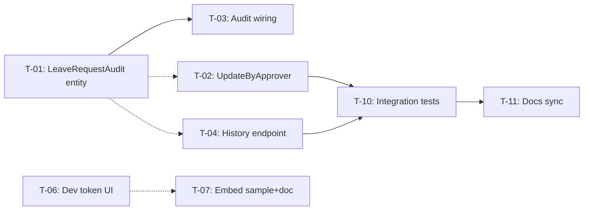

# Task List — Backend + Embed

## Mục tiêu

1. **Hoàn thiện backend .NET**: implement tất cả FastEndpoints theo BRD Appendix B (19 spec) + 3 thêm (DevLogin, My, Departments)
2. **Audit log**: `LeaveRequestAudit` entity + logging mutations (deferred, không block sprint)
3. **Embed/Token**: app chạy trong iframe nhận token qua `postMessage`; dev mode có UI nhập token thủ công
4. **Supabase cleanup**: xóa folder + deps, verify grep = 0

## Tham chiếu

- BRD: docs/vision/brd.md — BR-001→BR-008, AC-001→AC-021
- SRS: docs/vision/srs.md — FR-01→FR-11
- UC: docs/usecase/usecase.md — UC-01→UC-07
- Business Rules: BRULE-001→BRULE-011

---

## Trạng thái hiện tại (2026-06-03)

| Hạng mục | Trạng thái | Ghi chú |
|----------|------------|---------|
| API scaffold + EF Core + Entities (8/8) | ✅ Done | `LeaveRequestAudit` entity + migration added |
| System tables read-only | ✅ Done | |
| JWT Bearer + ICurrentUserProvider | ✅ Done | |
| Frontend api/client.ts + AuthContext | ✅ Done | |
| **Endpoint `.cs` files** | ✅ Done | All core endpoints implemented |
| DevLogin endpoint | ✅ Done | Build-time toggle |
| CSP frame-ancestors header | ✅ Done | Inline middleware in `Program.cs` |
| Dev mode manual token via postMessage | ✅ Done | FR-01.8, listener always active |
| Embed host sample + doc | ❌ Pending | FR-070→FR-072 |
| Supabase removal | ✅ Done | BR §9.1 |
| Audit log (entity + wiring) | 🟡 Partial | Entity done; wiring deferred (T-03) |
| Integration tests | ❌ Pending | AC-001→AC-021 |
| Auto-approve by requester role | ✅ Done | Leader/Director/Admin auto-approve levels ≤ role |
| Approvable requests API | ✅ Done | `GET /api/leave-requests/approvable` |
| Docs sync | 🟡 Partial | |

### Endpoint checklist (BRD Appendix B)

| # | Method | Path | Status | BRD ID |
|---|--------|------|--------|--------|
| 1 | GET | /api/auth/me | ✅ | FR-002 |
| 2 | GET | /api/leave-types | ✅ | FR-030 |
| 3 | POST | /api/leave-types | ✅ | FR-031 |
| 4 | PUT | /api/leave-types/{id} | ✅ | FR-031 |
| 5 | DELETE | /api/leave-types/{id} | ✅ | FR-031 |
| 6 | GET | /api/leave-requests | ✅ | FR-040 |
| 7 | POST | /api/leave-requests | ✅ | FR-041 |
| 8 | PUT | /api/leave-requests/{id} | ✅ | FR-042 |
| 9 | PUT | /api/leave-requests/{id}/update-by-approver | ❌ | FR-046 |
| 10 | POST | /api/leave-requests/{id}/approve | ✅ | FR-043 |
| 11 | POST | /api/leave-requests/{id}/reject | ✅ | FR-044 |
| 12 | POST | /api/leave-requests/{id}/cancel | ✅ | FR-045 |
| 13 | GET | /api/leave-requests/history | ❌ | FR-047 |
| 14 | GET | /api/leave-balances | ✅ | FR-050 |
| 15 | GET | /api/leave-balances/my | ✅ | FR-051 |
| 16 | GET | /api/system-configs | ✅ | FR-060 |
| 17 | PUT | /api/system-configs | ✅ | FR-061 |
| 18 | PUT | /api/system-configs/leave-configs | ✅ | FR-061 |
| 19 | GET | /api/system-configs/leave-configs | ✅ | FR-060 |
| 20 | GET | /api/reports/export | ✅ | FR-054 |
| 21 | GET | /api/reports/statistics | ✅ | Reports Statistics API |
| +1 | POST | /api/auth/dev-login | ✅ | FR-004 (dev) |
| +2 | GET | /api/leave-requests/my | ✅ | FR-04 (convenience) |
| +3 | GET | /api/leave-requests/approvable | ✅ | Approval filtering |
| +4 | GET | /api/departments | ✅ | FR-020 |
| +5 | GET | /api/departments/{id} | ✅ | FR-020 |
| +6 | GET | /api/my-stats | ✅ | Dashboard stats |

---

## Done tasks

✅ Completed (click to expand)

- **Auth slice**: JWT Bearer + ICurrentUserProvider + MeEndpoint + DevLogin — `933511c`, `92bfee8`
- **LeaveTypes CRUD**: List/Create/Update/Delete — `ff53235`
- **LeaveRequests P1**: List/Create/Update + business days + overlap — `4d419e2`
- **LeaveRequests P2**: Approve/Reject/Cancel + state machine — `a004ebd`
- **LeaveBalances + Config + Departments**: List/My/Get/Update + Depts — `e95a3cc`
- **CORS fix**: Frontend port 8081 — `a69842c`
- **LeaveRequest.RequestedApproverId**: nullable field added per decision #2
- **Reports/Export**: GET /api/reports/export + ClosedXML .xlsx generation — detail + aggregated sheets (month/quarter/year), Vietnamese labels, overlaps date filter — `Features/Reports/Export/`
- **Supabase cleanup**: Deleted `packages/web/supabase/`, removed env vars, updated README — `archive/supabase-migrations/`
- **Auto-approve by requester role**: Leader/Director/Admin tạo đơn → auto-approve cấp ≤ role; Staff → pending (unchanged). `ApprovalHelper.GetAutoApproveLevel()` + `ApprovalBalanceService` — `packages/api/Shared/Domain/`
- **Approvable requests API**: `GET /api/leave-requests/approvable` — config-driven filtering, Leader sees own dept, Director/Admin sees all — `packages/api/Features/LeaveRequests/Approvable/`
- **CSP frame-ancestors**: Inline middleware in `Program.cs`, configurable via `Security:FrameAncestors`
- **LeaveRequestAudit entity**: Entity + DbSet + migration `20260525041739_AddLeaveRequestAudit`
- **Lazy Seed LeaveBalances**: Auto-seed LeaveBalance rows on access + startup seed for QLNP users

---

## Pending tasks

### T-02: `UpdateByApprover` endpoint

- **What**: `PUT /api/leave-requests/{id}/update-by-approver`. Cho phép LĐ.PCM/GĐ.PGD cập nhật StartDate, EndDate, Reason khi phê duyệt. Chỉ khi status ∈ {pending, approved_leader}. Ghi audit log nếu T-01 done, nếu chưa thì skip audit (log warning).
- **Refs**: FR-046, AC-018, BRULE-010, UC-02 A-2
- **Dependencies**: T-01 (soft — hoạt động không audit nếu T-01 chưa done)
- **Files**:
  - Create: `packages/api/Features/LeaveRequests/UpdateByApprover/Endpoint.cs` + Data.cs + Models.cs
- **AC**: LĐ.PCM update đơn pending trong phòng → 200; GĐ.PGD update đơn approved_leader → 200; CB.PCM → 403; đơn approved_director → 400; nếu T-01 done → audit row created
- **Priority**: P0

### T-03: Audit logging wiring (Create/Update/UpdateByApprover/Approve/Reject)

- **What**: Thêm audit write vào mutation endpoints: Create (log initial values), Update (log changed fields), UpdateByApprover (log changed fields), Approve (log status change + approved_by), Reject (log status change + reason). Ghi vào `LeaveRequestAudits` table.
- **Refs**: BRULE-010, FR-05.7/05.8, FR-11.3, UC-02 A-2/A-3, UC-01 A-1
- **Dependencies**: T-01 (hard — cần entity + table)
- **Files**:
  - Modify: `packages/api/Features/LeaveRequests/Create/Endpoint.cs`
  - Modify: `packages/api/Features/LeaveRequests/Update/Endpoint.cs`
  - Modify: `packages/api/Features/LeaveRequests/Approve/Endpoint.cs`
  - Modify: `packages/api/Features/LeaveRequests/Reject/Endpoint.cs`
  - If T-02 done: `packages/api/Features/LeaveRequests/UpdateByApprover/Endpoint.cs`
- **AC**: Sau mỗi mutation → `LeaveRequestAudits` có row với ChangedBy = current user, ChangedAt = UTC now, FieldName/OldValue/NewValue đúng
- **Priority**: Low (deferred)

### T-04: `History` endpoint (ListHistory)

- **What**: `GET /api/leave-requests/history`. Role-based: CB.PCM xem đơn mình, LĐ.PCM xem đơn phòng, GĐ/PGĐ xem tất cả. Include audit logs nếu T-01 done. Filter: date range, status, leave type.
- **Refs**: FR-047, AC-020, BRULE-011, UC-01 A-4, UC-03 A-5, SRS FR-11
- **Dependencies**: T-01 (soft — hoạt động không audit data nếu T-01 chưa done)
- **Files**:
  - Create: `packages/api/Features/LeaveRequests/History/Endpoint.cs` + Data.cs + Models.cs
- **AC**: CB.PCM chỉ thấy đơn mình; LĐ.PCM thấy đơn phòng; GĐ/PGĐ thấy tất cả; filter status/loại phép/thời gian hoạt động; nếu T-01 done → include audits trong response
- **Priority**: P0

### T-06: Dev mode manual token input UI

- **What**: Frontend LoginPage thêm UI nhập token thủ công khi không ở embed mode VÀ `import.meta.env.DEV === true`. Input "JWT/Dev Token" + button "Đăng nhập với token". Lưu `localStorage.jwt` → gọi `authApi.me()` → redirect `/`.
- **Refs**: FR-01.8, SRS FR-01.8, UC-01 pre-condition
- **Dependencies**: —
- **Files**:
  - Modify: `packages/web/src/contexts/AuthContext.tsx` — thêm `setManualToken(token)`
  - Modify: `packages/web/src/pages/LoginPage.tsx` — thêm token input UI
- **AC**: Chạy `pnpm dev` → trang login hiện token input → nhập token → dashboard hiển thị; production build → ẩn input
- **Priority**: P0

### T-07: Embed host sample + postMessage doc

- **What**: Tạo `packages/web/public/embed-host-sample.html` — trang demo host: textarea token + button "Send via postMessage" + iframe trỏ `/`. Doc `docs/embed-integration.md` (≤ 200 dòng).
- **Refs**: FR-070→FR-072, AC-013, AC-014, BR-003, UC-07 (US-007)
- **Dependencies**: T-06 (soft — sample dùng được cả manual lẫn embed flow)
- **Files**:
  - Create: `packages/web/public/embed-host-sample.html`
  - Create: `docs/embed-integration.md`
- **AC**: Mở `embed-host-sample.html` → gửi `{ type: "auth", token }` → iframe gọi `/api/auth/me` → dashboard hiển thị
- **Priority**: P1

### T-10: Integration tests (AC-001→AC-021)

- **What**: E2E/integration test flow theo BRD AC checklist. Cover: auth flow, CRUD đơn, state machine, role filtering, overlap detection, balance update, embed token, auto-approve.
- **Refs**: AC-001→AC-021, SRS §6
- **Dependencies**: T-02, T-04 (test các endpoint mới)
- **Files**:
  - Create: `packages/api.tests/` hoặc xUnit project
- **AC**: Tất cả AC pass
- **Priority**: P0 (nhưng chạy sau khi các endpoint task done)

### T-11: Docs sync

- **What**: Cập nhật `docs/development-roadmap.md`, `docs/project-changelog.md`, `docs/system-architecture.md` nếu cần. Tag release.
- **Refs**: —
- **Dependencies**: T-10
- **Files**:
  - Modify: `docs/development-roadmap.md`
  - Modify: `docs/project-changelog.md`
  - Modify: `docs/system-architecture.md` (if needed)
- **AC**: Roadmap phase 1+2 marked Complete; changelog entry migration done; `dotnet build` + `pnpm build` OK
- **Priority**: P1

---

## Completed tasks (detail)

### T-01: `LeaveRequestAudit` entity + migration ✅ DONE

- **What**: Tạo entity `LeaveRequestAudit` + DbSet + migration. Fields: `Id`, `LeaveRequestId` (FK), `ChangedBy` (FK USER_MASTER), `ChangedAt`, `FieldName`, `OldValue`, `NewValue`
- **Refs**: BRULE-010, FR-05.7/05.8, SRS §4.2, UC-02 A-2/A-3, UC-01 A-1
- **Status**: ✅ Complete — entity, DbSet/config, and migration `20260525041739_AddLeaveRequestAudit`

### T-05: `Reports/Export` endpoint ✅ DONE

- **What**: `GET /api/reports/export`. Export leave requests ra Excel .xlsx. Chỉ GD.PGD. Filter: status, from, to, period (none/month/quarter/year). Aspose.Cells 20.11.0.
- **Refs**: FR-054, AC-019, BR-008, SRS FR-08.4, UC-06 A-3
- **Dependencies**: —
- **Files**:
  - Modify: `packages/api/Features/Reports/Export/ExcelBuilder.cs`
  - Modify: `packages/api/Features/Reports/Export/ExportReportEndpoint.cs`
  - Create: `packages/api/Features/Reports/Export/ExportModels.cs`
  - Create: `packages/api/Features/Reports/Export/ExportDataMapper.cs`
  - Create: `packages/api/Resources/ExcelTemplates/BaoCaoNghiPhep.xlsx`
  - Create: `packages/api/Infrastructure/AsposeLicenseSetup.cs`
- **AC**: Export chạy ok, detail sheet (period=none) có 1 sheet; period=month|quarter|year → 4 sheets, dùng Smart Markers.
- **Priority**: P0
- **Status**: ✅ Complete
- **Refs**: FR-054, AC-019, BR-008, SRS FR-08.4, UC-06 A-3
- **Status**: ✅ Complete — 1 detail sheet (period=none) or 4 sheets (period=month|quarter|year)

### T-08: CSP `frame-ancestors` header ✅ DONE

- **What**: ASP.NET middleware set `Content-Security-Policy: frame-ancestors ${Security:FrameAncestors}`. Config qua env var. Dev default `'self'`.
- **Refs**: NFR-002, BRD §4.2 note, CST-005, SRS §5.3
- **Status**: ✅ Complete — inline middleware in `Program.cs`

### T-09: Supabase removal ✅ DONE

- **What**: Xóa `packages/web/supabase/` toàn bộ. Gỡ deps. Verify grep = 0.
- **Refs**: BR-005, BRD §9.1 AC, SRS §6.3
- **Status**: ✅ Complete

### T-12: Auto-approve by requester role ✅ DONE

- **What**: Khi Leader/Director/Admin tạo đơn xin nghỉ, hệ thống tự động approve các cấp ≤ role của người gửi. Nếu role không match config nào nhưng là approver role → auto-approve tất cả → approved ngay. Staff tạo đơn → pending như cũ.
- **Refs**: BR-07 (self-approve constraint), ApprovalHelper, CreateLeaveRequestEndpoint
- **Key logic**:
  - `ApprovalHelper.GetAutoApproveLevel(user, flow)` → returns matchLevel or `AutoApproveAll` (-1)
  - matchLevel > 0 && matchLevel >= maxLevel → status = approved, deduct balance
  - matchLevel > 0 && matchLevel < maxLevel → ApprovedLevel = matchLevel, still pending for higher levels
  - matchLevel == 0 + has approver role → auto-approve ALL levels
  - matchLevel == 0 + Staff only → pending (unchanged)
- **Files**:
  - Modify: `packages/api/Shared/Domain/ApprovalHelper.cs` — added `GetAutoApproveLevel`, `HasApproverRole`, `AutoApproveAll` sentinel
  - Create: `packages/api/Shared/Domain/ApprovalBalanceService.cs` — extracted balance deduction logic
  - Modify: `packages/api/Features/LeaveRequests/Create/CreateLeaveRequestEndpoint.cs` — auto-approve on create
  - Modify: `packages/api/Features/LeaveRequests/Approve/ApproveLeaveRequestEndpoint.cs` — use shared balance service
- **Scenarios**:
  | Requester | LeaveType Config | matchLevel | Result |
  |-----------|-----------------|-----------|--------|
  | Staff | 1:L, 2:D | 0 | pending |
  | Leader | 1:L, 2:D | 1 | pending (đợi D) |
  | Leader | 1:L | 1=max | approved |
  | Director | 1:L, 2:D | 2=max | approved |
  | Director | 1:L | 0, D role | approved (auto-all) |
  | Admin | any | 0, Admin | approved (auto-all) |
- **AC**: Leader tạo đơn → auto-approve cấp L, pending cho cấp D; Director/Admin tạo đơn → approved ngay; Staff → pending; balance deducted khi fully approved
- **Priority**: P2

### T-13: Approvable requests API ✅ DONE

- **What**: `GET /api/leave-requests/approvable`. Trả về pending leave requests mà current user có quyền approve ở cấp tiếp theo. Config-driven filtering — FE chỉ cần 1 API call.
- **Refs**: Approval filtering, LeaveRequestGroup
- **Files**:
  - Create: `packages/api/Features/LeaveRequests/Approvable/ListApprovableRequestsEndpoint.cs`
  - Create: `packages/web/src/features/approval/hooks/use-approvable-requests.ts`
  - Delete: `packages/web/src/features/approval/api/approval.api.ts` (replaced by leave-requests API)
  - Delete: `packages/web/src/features/approval/hooks/use-approval-requests.ts` (replaced by use-approvable-requests)
- **Logic**:
  - Director/Admin: all pending requests
  - Leader: same department only (self-approval blocked by ApprovalHelper)
  - Staff: empty list (no approval rights)
  - Each request validated against `LeaveConfig` + `ApprovalHelper.CanApproveAtLevel`
- **AC**: Leader thấy pending đơn trong phòng (trừ đơn mình); Director/Admin thấy tất cả pending; Staff thấy []; FE hook `useApprovableRequests` hoạt động
- **Priority**: P2

---

## Dependency graph

Solid arrow = hard dependency. Dotted = soft (works without, feature reduced).

---

## Checklist nghiệm thu (BRD §9.1)

- [x] Auto-approve: Leader/Director/Admin tạo đơn → auto-approve levels ≤ role; Staff → pending
- [x] Approvable requests API: `GET /api/leave-requests/approvable` config-driven filtering
- [ ] 23/23 endpoints hoạt động (19 BRD + extras), response format consistent (missing: UpdateByApprover, History)
- [x] `grep -r "supabase" packages/web/src/` = 0
- [x] `packages/web/supabase/` xóa hoàn toàn
- [ ] QLNP không lưu/verify password
- [ ] Embed flow: host postMessage → `/api/auth/me` → dashboard
- [ ] Dev mode token input UI hoạt động khi `import.meta.env.DEV`
- [x] Approval 2 cấp đúng state machine; business days đúng (bỏ T7/CN); auto-approve for approver roles
- [x] `dotnet build` + `pnpm build` không lỗi
- [ ] AC-001→AC-021 pass

---

## Rủi ro & Mitigation

| Rủi ro | Mức độ | Mitigation |
|--------|--------|-----------|
| DTO frontend mismatch backend | High | T-10 integration tests catch mismatches |
| JWT validation config sai production | Medium | T-07 doc cho host team rõ config |
| LeaveBalances.UsedDays cộng dồn sai khi approve | Medium | T-10 test AC-012 |
| Iframe bị block bởi frame policy | Medium | T-08 CSP frame-ancestors header |
| Audit entity thêm migration lớn | Low | T-01 isolated, rollback dễ |
| Aspose.Cells license (Reports/Export) | ✅ Resolved | Aspose.Cells 20.11.0 (watermark if missing) |
| Supabase migrations folder có info hữu ích | Low | Backup `archive/` trước khi xóa |
| Auto-approve bypass unintended levels | Low | ApprovalHelper.GetAutoApproveLevel chỉ match configured roles; full approve chỉ khi matchLevel >= maxLevel hoặc approver-without-match |

---

## Quyết định kỹ thuật

1. **Định mức ngày nghỉ**: KHÔNG hardcode 12. Source: `LeaveType.DefaultDays` → seed/upsert vào `LeaveBalance.TotalDays`. Frontend đọc `TotalDays - UsedDays`.
2. **`ApprovedBy` ambiguity**: Tách `RequestedApproverId` + `ApprovedBy` — RequestedApproverId lưu khi Create, ApprovedBy ghi đè khi Approve/Reject = current user.
3. **Endpoint approve/reject**: Sub-resource `POST /api/leave-requests/{id}/approve` và `/reject`.
4. **CSP `frame-ancestors`**: Config qua `Security:FrameAncestors` env var. Dev default `'self'`.
5. **Audit logging**: Full audit (all mutations + status transitions) nhưng **deferred** — không block sprint. T-01 entity tạo sẵn, T-03 wiring làm sau.
6. **Reports/Export**: Dùng Aspose.Cells 20.11.0 với Smart Markers (template-based) cho .xlsx generation. `period=none` → 1 detail sheet; `period=month|quarter|year` → 4 sheets.
7. **Auto-approve by requester role**: `ApprovalHelper.GetAutoApproveLevel()` determines how many levels to auto-approve based on requester roles vs approval flow config. `AutoApproveAll` sentinel (-1) handles approver roles that don't match any configured level. Balance deducted in same transaction when fully auto-approved.
8. **Approvable requests**: `GET /api/leave-requests/approvable` — config-driven, single API call for FE. Registered before generic `GET ""` route to prevent shadowing.