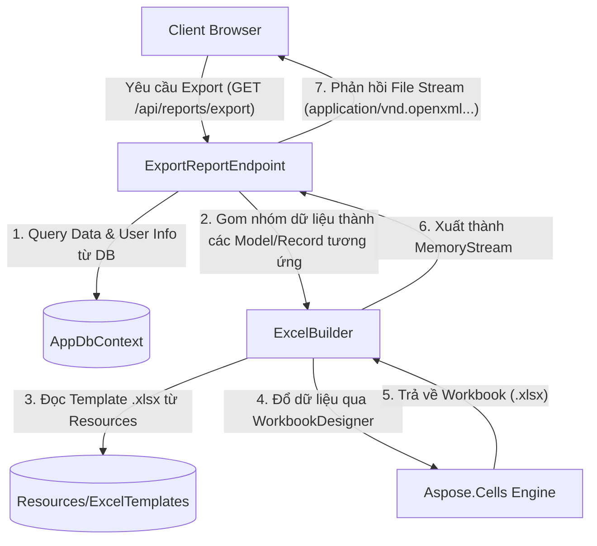

# Research & Brainstorming Report: Aspose.Cells Excel Export Architecture

* **Ngày thực hiện:** 08/06/2026
* **Hệ thống đích:** QLNP API (.NET 8 Core API / FastEndpoints)
* **Thành phần tham chiếu gốc:** `ClosedXML` tại [ExcelBuilder.cs](file:///home/vif/qlnp-ttcds/packages/api/Features/Reports/Export/ExcelBuilder.cs)

---

## 1. Tuyên bố Bài toán & Yêu cầu (Problem Statement)
Hệ thống quản lý nghỉ phép (QLNP) hiện tại đang sử dụng thư viện `ClosedXML` để tự xây dựng file Excel báo cáo dòng-qua-dòng bằng code C#. Phương án này gây khó khăn khi cần thay đổi định dạng, phong cách thiết kế của file báo cáo (font chữ, màu sắc, tiêu đề, logo) vì mỗi lần sửa đổi giao diện đều cần phải chỉnh sửa mã nguồn và tiến hành biên dịch/triển khai lại hệ thống.

### Yêu cầu mới:
* Thiết kế lại hệ thống xuất Excel sử dụng thư viện **Aspose.Cells**.
* Hỗ trợ cấu hình file template tĩnh dạng `.xlsx`.
* Xuất file dữ liệu động dựa trên template tĩnh mà vẫn giữ nguyên định dạng.
* Tích hợp License có sẵn của Aspose để loại bỏ watermark và giới hạn dòng.
* Quy mô dữ liệu xuất dao động ở mức vừa phải (vài nghìn dòng), cho phép xử lý trực tiếp trên bộ nhớ (In-Memory).

---

## 2. Đánh giá các Phương án Kỹ thuật (Evaluated Approaches)

### Phương án 1: Tạo file Excel thủ công bằng API của Aspose.Cells (Tương tự cách viết ClosedXML hiện tại)
* **Ưu điểm:** Kiểm soát hoàn toàn lập trình định dạng của từng ô bằng code C#.
* **Nhược điểm:** Code dài, phức tạp, khó bảo trì. Mọi thay đổi về định dạng của người dùng/designer đều đòi hỏi lập trình viên phải sửa code và redeploy.
* **Đánh giá:** Không đạt yêu cầu "xuất theo template" của bài toán.

### Phương án 2: Sử dụng Aspose.Cells Smart Markers (Được khuyên dùng và thống nhất lựa chọn)
* **Ưu điểm:**
  * Tách biệt hoàn toàn phần thiết kế (Excel Template) và phần xử lý dữ liệu (C# API).
  * Chỉ cần kéo thả, định dạng file Excel trực quan, ghi các Token (Ví dụ: `&=Requests.HoTen`) vào các ô mong muốn.
  * Hiệu năng xử lý cực tốt với lớp tối ưu `WorkbookDesigner`.
  * Hỗ trợ tự động áp dụng công thức động (Dynamic Formulas), tự chèn dòng mới, tự động gộp nhóm dữ liệu mà không cần viết code xử lý thuật toán phức tạp.
* **Nhược điểm:** Phải quản lý thêm các file template vật lý `.xlsx` trong ứng dụng.
* **Đánh giá:** Lựa chọn tối ưu nhất cho hệ thống này.

---

## 3. Kiến trúc Đề xuất (Architecture & Design)

Hệ thống sẽ được tái cấu trúc dựa trên cơ chế **Smart Markers** của Aspose.Cells:



### A. Quản lý File Template:
* Các tệp template `.xlsx` được lưu trữ tĩnh trong thư mục: `packages/api/Resources/ExcelTemplates/`.
* Cấu hình tệp tin dự án `QLNP.Api.csproj` để tự động sao chép các tệp template này ra thư mục biên dịch `bin/` khi build:
  ```xml
  <ItemGroup>
    <None Update="Resources\ExcelTemplates\*.xlsx">
      <CopyToOutputDirectory>PreserveNewest</CopyToOutputDirectory>
    </None>
  </ItemGroup>
  ```

### B. Cơ chế Khởi tạo License Toàn cục:
* License của Aspose sẽ được cấu hình nạp duy nhất một lần tại hàm khởi tạo ứng dụng `Program.cs` nhằm tối ưu hóa tài nguyên hệ thống, tránh nạp đi nạp lại file license gây thắt nút cổ chai hiệu năng.

---

## 4. Rủi ro & Giải pháp giảm thiểu (Risks & Mitigations)

| Rủi ro | Giải pháp giảm thiểu |
| :--- | :--- |
| File template `.xlsx` bị thiếu hoặc bị xóa nhầm trong thư mục Resource dẫn đến crash API. | Sử dụng cơ chế kiểm tra `File.Exists(path)` trước khi xử lý, ném ra mã lỗi thân thiện cho client thay vì gây crash. |
| Memory Leak khi lưu dữ liệu vào luồng Stream. | Đảm bảo bọc toàn bộ luồng xuất Stream và đối tượng `Workbook` / `WorkbookDesigner` vào khối lệnh `using` hoặc giải phóng thủ công qua `Dispose()`. |
| Căn chỉnh cột không tự động làm tràn nội dung số hiển thị thành ký tự `###`. | Sử dụng hàm `AutoFitColumns()` sau khi gọi `Process()` để Aspose tự tính toán độ rộng tối thiểu cho các cột dựa trên dữ liệu thật. |

---

## 5. Kế hoạch Triển khai (Next Steps)
1. Cập nhật file cấu hình dự án `QLNP.Api.csproj` để tích hợp thư viện `Aspose.Cells` và thiết lập thư mục `Resources/ExcelTemplates/`.
2. Tạo file template `BaoCaoNghiPhepTemplate.xlsx` chứa các Smart Markers tương ứng với 4 Sheets cần xuất:
   * Sheet `Chi tiết`: Dùng marker `&=Details.HoTen`, `&=Details.TenDonVi`,...
   * Sheet `Nhân viên - Loại phép`: Dùng `&=EmployeeLeaves.HoTen`,...
   * Sheet `Theo phòng ban`: Dùng `&=Departments.TenDonVi`,...
   * Sheet `Tổng hợp`: Dùng `&=Summary.Ky`,...
3. Viết lại logic trong `ExcelBuilder.cs` để nhận các tập dữ liệu, liên kết (Bind) vào `WorkbookDesigner` và thực hiện `Process()`.
4. Điều chỉnh `ExportReportEndpoint.cs` để tích hợp luồng xử lý mới của Aspose.Cells.
